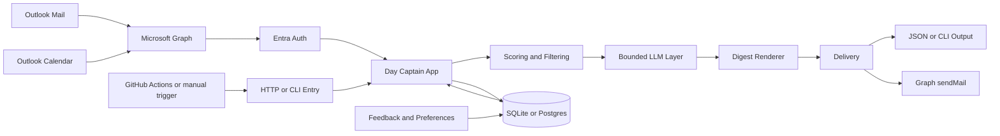

# Day Captain

Day Captain is a Python service that builds a daily Microsoft 365 digest from Outlook mail and calendar data.



It currently supports:
- delegated Microsoft Graph auth through Microsoft Entra ID device code flow
- message and meeting ingestion from Graph
- deterministic scoring and anti-noise filtering
- optional bounded LLM wording on shortlisted digest items with deterministic fallback
- optional bounded top-of-digest summary block with deterministic fallback
- digest generation with `critical_topics`, `actions_to_take`, `watch_items`, and `upcoming_meetings`
- persisted runs, feedback, and preferences
- local CLI usage
- a minimal hosted HTTP surface for Render

## Project status

Current package version: `0.8.0`

This repository is in active development. The core digest flow works locally and against a real Microsoft 365 mailbox. The hosted Render path is scaffolded, and a dedicated hardening track exists in Logics before treating it as production-ready.

Current operating model:
- local runs still default to one mailbox at a time
- the roadmap now explicitly targets one company tenant with multiple users, each receiving a separate digest
- tenant-scoped storage and explicit per-user execution are implemented for operator-managed multi-user hosting
- the remaining Logics work is now mainly hosted validation and operational proof for that model

## Repository layout

- `src/day_captain/`: application code
- `tests/`: unit and integration-style tests
- `logics/`: request, backlog, specs, and task tracking
- `render.yaml`: Render deployment blueprint
- `.github/workflows/`: CI and example hosted trigger workflows

Recommended repository split:
- `day-captain`: application source code
- `day-captain-ops`: private GitHub repository for production scheduling, deployment orchestration, and secrets

Planned operating model:
- one Microsoft 365 company tenant
- several explicitly configured users/mailboxes inside that tenant
- one digest run per target user
- strict tenant-scoped and user-scoped data isolation

## Core components

- `config.py`: environment-driven settings
- `app.py`: application assembly and main digest flow
- `adapters/auth.py`: Microsoft Entra device code auth and token cache
- `adapters/graph.py`: Microsoft Graph mail/calendar adapters
- `adapters/storage.py`: `SQLite` and Postgres-backed persistence
- `services.py`: scoring, filtering, digest rendering, recall, and feedback logic
- `web.py`: hosted HTTP endpoints for health, morning digest, and recall
- `cli.py`: command-line entrypoints

## Requirements

- Python `3.9+`
- a Microsoft Entra app registration for Graph delegated auth
- Graph delegated permissions:
  - `User.Read`
  - `Mail.Read`
  - `Calendars.Read`
  - optionally `Mail.Send`

## Installation

```bash
python3 -m venv .venv
source .venv/bin/activate
pip install -e ".[dev]"
```

## Configuration

Start from [`.env.example`](./.env.example).

Local development typically uses:

```env
DAY_CAPTAIN_ENV=development
DAY_CAPTAIN_SQLITE_PATH=day_captain.sqlite3
DAY_CAPTAIN_DELIVERY_MODE=json
DAY_CAPTAIN_GRAPH_TENANT_ID=common
DAY_CAPTAIN_GRAPH_CLIENT_ID=your-app-client-id
DAY_CAPTAIN_GRAPH_AUTH_CACHE_PATH=.day_captain_auth.json
DAY_CAPTAIN_GRAPH_SCOPES=User.Read,Mail.Read,Calendars.Read,Mail.Send
DAY_CAPTAIN_DISPLAY_TIMEZONE=Europe/Paris
DAY_CAPTAIN_DIGEST_LANGUAGE=en
DAY_CAPTAIN_LLM_LANGUAGE=
DAY_CAPTAIN_LLM_PROVIDER=disabled
DAY_CAPTAIN_LLM_MODEL=
DAY_CAPTAIN_LLM_API_KEY=
```

Hosted deployment typically uses:

```env
DAY_CAPTAIN_ENV=production
DAY_CAPTAIN_DATABASE_URL=postgresql://...
DAY_CAPTAIN_JOB_SECRET=...
DAY_CAPTAIN_DELIVERY_MODE=graph_send
DAY_CAPTAIN_GRAPH_AUTH_MODE=app_only
DAY_CAPTAIN_GRAPH_CLIENT_ID=...
DAY_CAPTAIN_GRAPH_CLIENT_SECRET=...
DAY_CAPTAIN_GRAPH_TENANT_ID=...
DAY_CAPTAIN_TARGET_USERS=alice@example.com,bob@example.com
DAY_CAPTAIN_GRAPH_SEND_ENABLED=true
DAY_CAPTAIN_DISPLAY_TIMEZONE=Europe/Paris
DAY_CAPTAIN_DIGEST_LANGUAGE=en
DAY_CAPTAIN_LLM_LANGUAGE=en
DAY_CAPTAIN_LLM_PROVIDER=openai
DAY_CAPTAIN_LLM_MODEL=gpt-5-mini
DAY_CAPTAIN_LLM_API_KEY=...
```

Important hosted note:
- hosted runs are now tenant-scoped and user-scoped, with one explicit target user per execution
- configure explicit recipients with `DAY_CAPTAIN_TARGET_USERS`
- `DAY_CAPTAIN_GRAPH_USER_ID` remains supported as a single-user fallback and default target
- hosted Graph auth now supports an explicit `DAY_CAPTAIN_GRAPH_AUTH_MODE=app_only` path for unattended environments

Important:
- never commit `.env`
- never commit Graph access or refresh tokens
- never commit LLM API keys
- local token cache and local databases are already git-ignored

## AI wording layer

The digest still uses deterministic scoring and guardrails to decide what matters.

If `DAY_CAPTAIN_LLM_PROVIDER` is enabled, Day Captain sends only a bounded shortlist of already-prioritized digest items to an OpenAI-compatible chat-completions endpoint to improve summary wording. If the provider is disabled, misconfigured, or fails at runtime, the app falls back to the deterministic summaries already present in the scored items.

You can constrain that wording pass with `DAY_CAPTAIN_LLM_ENABLED_SECTIONS`, steer the tone with `DAY_CAPTAIN_LLM_STYLE_PROMPT`, and force the wording language with `DAY_CAPTAIN_LLM_LANGUAGE`. If `DAY_CAPTAIN_LLM_LANGUAGE` is unset, it falls back to `DAY_CAPTAIN_DIGEST_LANGUAGE`.

The digest can also render a short top summary block above the detailed sections. That summary is built only from the final digest content, stays bounded, and falls back to a deterministic overview if the LLM path is disabled or fails.

## Digest presentation

The delivered digest now supports:
- localized product copy through `DAY_CAPTAIN_DIGEST_LANGUAGE` with English default and French support
- assistant-style header and empty-state wording even when the LLM layer is disabled
- weekend meeting fallback to Monday and next-day meeting fallback when no meetings remain for the current day

## Microsoft auth setup

Local delegated workflow:

1. Create an Entra app registration.
2. Enable public client flows.
3. Add delegated Microsoft Graph permissions.
4. Export your local env vars.
5. Run:

```bash
set -a
source .env
set +a
PYTHONPATH=src python3 -m day_captain auth login
```

Useful auth commands:

```bash
PYTHONPATH=src python3 -m day_captain auth status
PYTHONPATH=src python3 -m day_captain auth login
PYTHONPATH=src python3 -m day_captain auth logout
```

If you add `Mail.Send` or change delegated scopes, rerun `PYTHONPATH=src python3 -m day_captain auth login` so the cached token is refreshed with the new consented scope set.

When `delivery_mode=graph_send`, the current local delegated flow sends through `POST /me/sendMail`. If the rendered message does not already include recipients, the app defaults to the authenticated mailbox address returned by the Graph profile.

Hosted app-only workflow:
- set `DAY_CAPTAIN_GRAPH_AUTH_MODE=app_only`
- provide `DAY_CAPTAIN_GRAPH_CLIENT_ID`
- provide `DAY_CAPTAIN_GRAPH_CLIENT_SECRET`
- provide `DAY_CAPTAIN_GRAPH_TENANT_ID`
- provide `DAY_CAPTAIN_TARGET_USERS`
- grant the corresponding Graph application permissions in Entra

In hosted app-only mode, Day Captain targets explicit `/users/{id}` routes for mailbox reads, calendar reads, and `sendMail` instead of relying on a permanent `/me` identity. When several users are configured, each run must choose one explicit target user.

## Local usage

Run a digest directly:

```bash
set -a
source .env
set +a
PYTHONPATH=src python3 -m day_captain morning-digest --force
```

Run a digest for one configured hosted target:

```bash
PYTHONPATH=src python3 -m day_captain morning-digest --force --target-user alice@example.com
```

Recall the latest digest:

```bash
PYTHONPATH=src python3 -m day_captain recall-digest
```

Recall a specific configured target:

```bash
PYTHONPATH=src python3 -m day_captain recall-digest --target-user alice@example.com
```

Record feedback:

```bash
PYTHONPATH=src python3 -m day_captain record-feedback \
  --run-id RUN_ID \
  --source-kind message \
  --source-id MESSAGE_ID \
  --signal-type useful \
  --signal-value true \
  --target-user alice@example.com
```

## Local HTTP service

Start the local web service:

```bash
set -a
source .env
set +a
PYTHONPATH=src python3 -m day_captain serve
```

Healthcheck:

```bash
curl http://127.0.0.1:8000/healthz
```

Trigger a digest through the HTTP endpoint:

```bash
curl -X POST http://127.0.0.1:8000/jobs/morning-digest \
  -H "Content-Type: application/json" \
  -H "X-Day-Captain-Secret: $DAY_CAPTAIN_JOB_SECRET" \
  -d '{"force": true}'
```

Trigger one configured target user explicitly:

```bash
curl -X POST http://127.0.0.1:8000/jobs/morning-digest \
  -H "Content-Type: application/json" \
  -H "X-Day-Captain-Secret: $DAY_CAPTAIN_JOB_SECRET" \
  -d '{"force": false, "target_user_id": "alice@example.com"}'
```

Recall through HTTP:

```bash
curl -X POST http://127.0.0.1:8000/jobs/recall-digest \
  -H "Content-Type: application/json" \
  -H "X-Day-Captain-Secret: $DAY_CAPTAIN_JOB_SECRET" \
  -d '{}'
```

## Testing

Run the full test suite:

```bash
python3 -m unittest discover -s tests
```

Run targeted tests:

```bash
python3 -m unittest tests.test_scoring
python3 -m unittest tests.test_web
python3 -m unittest tests.test_graph_client
```

## Storage model

Current persistence covers tenant-scoped and user-scoped tables for:
- `messages`
- `meetings`
- `digest_runs`
- `digest_items`
- `feedback`
- `preferences`

Current model:
- one deployment serves one Microsoft 365 tenant
- digest data is partitioned by `tenant_id` and `user_id`
- only users listed in `DAY_CAPTAIN_TARGET_USERS` are valid hosted recipients by default

Local mode uses `SQLite`.

Hosted mode is wired for Postgres through `DAY_CAPTAIN_DATABASE_URL`.

## Render deployment

The repository includes [`render.yaml`](./render.yaml) for a first hosted deployment path:
- Render web service
- Render Postgres
- `python -m day_captain serve`
- `/healthz` healthcheck

Expected hosted secrets/config include:
- `DAY_CAPTAIN_DATABASE_URL`
- `DAY_CAPTAIN_JOB_SECRET`
- Graph / Entra settings

## GitHub Actions

This repository currently includes two workflow categories:
- CI checks
- an example scheduled hosted trigger for the morning digest

The scheduler workflow is in [`morning-digest-scheduler.yml`](./.github/workflows/morning-digest-scheduler.yml) and expects:
- `DAY_CAPTAIN_SERVICE_URL`
- `DAY_CAPTAIN_JOB_SECRET`
- optional `DAY_CAPTAIN_TARGET_USERS_JSON` repository variable for scheduled multi-user fan-out

For the operator workflow used by the bounded multi-user model, see [`tenant_scoped_multi_user_operator_guide.md`](./docs/tenant_scoped_multi_user_operator_guide.md).

Recommended production setup:
- keep CI here if you want public validation
- move real scheduling and production secrets into a private `day-captain-ops` repository
- let the private repo trigger the hosted Day Captain service over HTTPS

## Security note

The hosted path exists, but a separate hardening track is still open in Logics:
- [`req_001_day_captain_hosted_security_hardening.md`](./logics/request/req_001_day_captain_hosted_security_hardening.md)
- [`item_001_day_captain_hosted_security_hardening.md`](./logics/backlog/item_001_day_captain_hosted_security_hardening.md)
- [`task_004_day_captain_hosted_security_hardening.md`](./logics/tasks/task_004_day_captain_hosted_security_hardening.md)

Treat the current Render deployment path as staging-quality until that hardening task is implemented.

## Logics

Main product chain:
- [`req_000_day_captain_daily_assistant_for_microsoft_365.md`](./logics/request/req_000_day_captain_daily_assistant_for_microsoft_365.md)
- [`item_000_day_captain_daily_assistant_for_microsoft_365.md`](./logics/backlog/item_000_day_captain_daily_assistant_for_microsoft_365.md)
- [`task_003_day_captain_render_deployment_and_scheduler.md`](./logics/tasks/task_003_day_captain_render_deployment_and_scheduler.md)

## Next steps

- harden the hosted security path
- validate a real Render deployment end to end
- switch the hosted scheduler to a production-safe operating mode
- continue tuning scoring and feedback behavior on real mailbox data
