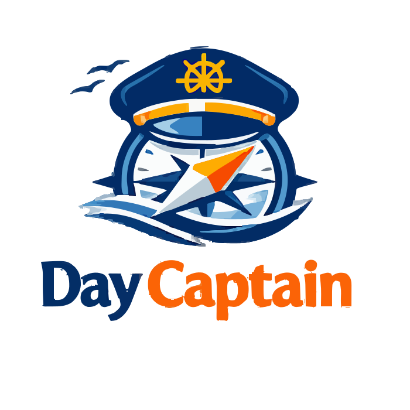
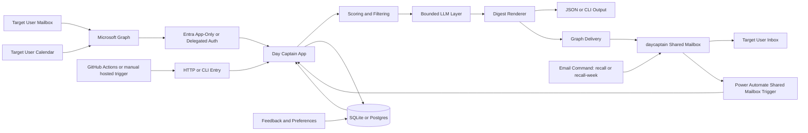

# Day Captain

<p align="center">
  
</p>

<p align="center">
  <a href="https://github.com/example-owner/day-captain/actions/workflows/ci.yml"></a>
  <a href="./LICENSE"></a>
  
  
  
  
</p>

Day Captain is a Python service that builds a daily Microsoft 365 digest from Outlook mail and calendar data.



It currently supports:
- delegated Microsoft Graph auth through Microsoft Entra ID device code flow
- message and meeting ingestion from Graph
- deterministic scoring and anti-noise filtering
- optional bounded LLM wording on shortlisted digest items with deterministic fallback
- optional bounded top-of-digest summary block with deterministic fallback
- digest generation with `critical_topics`, `actions_to_take`, `watch_items`, and `upcoming_meetings`
- persisted runs, feedback, and preferences
- local CLI usage
- a minimal hosted HTTP surface for Render

## Project status

Current package version: `1.4.1`

This repository is in active development. The core digest flow works locally and against a real Microsoft 365 mailbox. The hosted Render path is scaffolded, and a dedicated hardening track exists in Logics before treating it as production-ready.

Current operating model:
- local runs still default to one mailbox at a time
- the roadmap now explicitly targets one company tenant with multiple users, each receiving a separate digest
- tenant-scoped storage and explicit per-user execution are implemented for operator-managed multi-user hosting
- the remaining Logics work is now mainly production hardening and hosted operational proof for that model
- the current open hardening track includes hosted Graph trust-boundary enforcement and shared-secret validation tightening

## Repository layout

- `src/day_captain/`: application code
- `tests/`: unit and integration-style tests
- `logics/`: request, backlog, specs, and task tracking
- `render.yaml`: Render deployment blueprint
- `.github/workflows/`: CI and example hosted trigger workflows
- `docs/assets/`: shared documentation assets such as the project logo
- `CONTRIBUTING.md`: contributor workflow and validation expectations
- `LICENSE`: current repository license terms

Recommended repository split:
- `day-captain`: application source code
- `day-captain-ops`: private GitHub repository for production scheduling, deployment orchestration, and secrets

Planned operating model:
- one Microsoft 365 company tenant
- several explicitly configured users/mailboxes inside that tenant
- one digest run per target user
- strict tenant-scoped and user-scoped data isolation

## Core components

- `config.py`: environment-driven settings
- `app.py`: application assembly and main digest flow
- `adapters/auth.py`: Microsoft Entra device code auth and token cache
- `adapters/graph.py`: Microsoft Graph mail/calendar adapters
- `adapters/storage.py`: `SQLite` and Postgres-backed persistence
- `services.py`: scoring, filtering, digest rendering, recall, and feedback logic
- `web.py`: hosted HTTP endpoints for health, morning digest, and recall
- `cli.py`: command-line entrypoints

## Requirements

- Python `3.9+`
- a Microsoft Entra app registration for Graph delegated auth
- Graph delegated permissions:
  - `User.Read`
  - `Mail.Read`
  - `Calendars.Read`
  - optionally `Mail.Send`

## Installation

```bash
python3 -m venv .venv
source .venv/bin/activate
pip install -e ".[dev]"
```

## Configuration

Start from [`.env.example`](./.env.example).

Local development typically uses:

```env
DAY_CAPTAIN_ENV=development
DAY_CAPTAIN_SQLITE_PATH=day_captain.sqlite3
DAY_CAPTAIN_DELIVERY_MODE=json
DAY_CAPTAIN_GRAPH_TENANT_ID=common
DAY_CAPTAIN_GRAPH_CLIENT_ID=your-app-client-id
DAY_CAPTAIN_GRAPH_AUTH_CACHE_PATH=.day_captain_auth.json
DAY_CAPTAIN_GRAPH_SCOPES=User.Read,Mail.Read,Calendars.Read,Mail.Send
DAY_CAPTAIN_DISPLAY_TIMEZONE=Europe/Paris
DAY_CAPTAIN_DIGEST_LANGUAGE=en
DAY_CAPTAIN_LLM_LANGUAGE=
DAY_CAPTAIN_WEATHER_LATITUDE=
DAY_CAPTAIN_WEATHER_LONGITUDE=
DAY_CAPTAIN_WEATHER_LOCATION_NAME=
DAY_CAPTAIN_LLM_PROVIDER=disabled
DAY_CAPTAIN_LLM_MODEL=
DAY_CAPTAIN_LLM_API_KEY=
```

Hosted deployment typically uses:

```env
DAY_CAPTAIN_ENV=production
DAY_CAPTAIN_DATABASE_URL=postgresql://...
DAY_CAPTAIN_JOB_SECRET=...
DAY_CAPTAIN_DELIVERY_MODE=graph_send
DAY_CAPTAIN_GRAPH_AUTH_MODE=app_only
DAY_CAPTAIN_GRAPH_CLIENT_ID=...
DAY_CAPTAIN_GRAPH_CLIENT_SECRET=...
DAY_CAPTAIN_GRAPH_TENANT_ID=...
DAY_CAPTAIN_TARGET_USERS=alice@example.com,bob@example.com
DAY_CAPTAIN_GRAPH_SENDER_USER_ID=daycaptain@example.com
DAY_CAPTAIN_EMAIL_COMMAND_ALLOWED_SENDERS=assistant@example.com=alice@example.com
DAY_CAPTAIN_GRAPH_SEND_ENABLED=true
DAY_CAPTAIN_DISPLAY_TIMEZONE=Europe/Paris
DAY_CAPTAIN_DIGEST_LANGUAGE=en
DAY_CAPTAIN_LLM_LANGUAGE=en
DAY_CAPTAIN_WEATHER_LATITUDE=48.8566
DAY_CAPTAIN_WEATHER_LONGITUDE=2.3522
DAY_CAPTAIN_WEATHER_LOCATION_NAME=Paris
DAY_CAPTAIN_LLM_PROVIDER=openai
DAY_CAPTAIN_LLM_MODEL=gpt-5-mini
DAY_CAPTAIN_LLM_API_KEY=...
```

Important hosted note:
- hosted runs are now tenant-scoped and user-scoped, with one explicit target user per execution
- configure explicit recipients with `DAY_CAPTAIN_TARGET_USERS`
- `DAY_CAPTAIN_GRAPH_SENDER_USER_ID` can send mail from a dedicated mailbox such as `daycaptain@company.com` while reads stay scoped to the selected target mailbox
- `DAY_CAPTAIN_EMAIL_COMMAND_ALLOWED_SENDERS` can allow a bounded helper sender set for inbound email-command recall; in single-target setups bare senders still work, while multi-user setups must use explicit `sender=target` mappings
- `DAY_CAPTAIN_GRAPH_USER_ID` remains supported as a single-user fallback and default target
- hosted Graph auth now supports an explicit `DAY_CAPTAIN_GRAPH_AUTH_MODE=app_only` path for unattended environments
- weather is optional and enabled only when both `DAY_CAPTAIN_WEATHER_LATITUDE` and `DAY_CAPTAIN_WEATHER_LONGITUDE` are configured; `DAY_CAPTAIN_WEATHER_LOCATION_NAME` controls the capsule label shown in the digest

Important:
- never commit `.env`
- never commit Graph access or refresh tokens
- never commit LLM API keys
- local token cache and local databases are already git-ignored

## AI wording layer

The digest still uses deterministic scoring and guardrails to decide what matters.

If `DAY_CAPTAIN_LLM_PROVIDER` is enabled, Day Captain sends only a bounded shortlist of already-prioritized digest items to an OpenAI-compatible chat-completions endpoint to improve summary wording. If the provider is disabled, misconfigured, or fails at runtime, the app falls back to the deterministic summaries already present in the scored items.

You can constrain that wording pass with `DAY_CAPTAIN_LLM_ENABLED_SECTIONS`, steer the tone with `DAY_CAPTAIN_LLM_STYLE_PROMPT`, and force the wording language with `DAY_CAPTAIN_LLM_LANGUAGE`. If `DAY_CAPTAIN_LLM_LANGUAGE` is unset, it falls back to `DAY_CAPTAIN_DIGEST_LANGUAGE`.

The digest can also render a top summary block above the detailed sections. That summary is built only from the final digest content, is no longer forcibly truncated by app policy, and falls back to a deterministic overview if the LLM path is disabled or fails.

## Digest presentation

The delivered digest now supports:
- localized product copy through `DAY_CAPTAIN_DIGEST_LANGUAGE` with English default and French support
- a condensed header with explicit as-of/window metadata and a more polished coverage line instead of verbose report phrasing
- a highlighted `In brief` / `En bref` executive summary block above the detailed sections
- a full `In brief` / `En bref` block that is no longer forcibly shortened by the application when the summary remains useful but long
- an optional weather capsule before `In brief` / `En bref`, including a simple warmer/cooler-than-yesterday signal when weather data is configured
- stronger prominence for flagged messages through scoring promotion and a dedicated badge in text and HTML rendering
- compact meeting cards that keep time, organizer, and location easy to scan with more natural day-horizon wording
- lighter empty-state presentation even when the LLM layer is disabled
- lighter hero/card visual treatment than the first readability pass
- optional footer quick actions using `mailto:` links that open a prefilled draft for recall commands, with the command repeated in subject and body when a command mailbox is known
- source-open controls that keep Outlook web links as the reliable baseline and prefer an explicit desktop protocol link only when a native Outlook link is already available in the source metadata
- weekend meeting fallback to Monday and next-day meeting fallback when no meetings remain for the current day
- first-run `morning-digest` mail fallback to Friday `00:00` in `DAY_CAPTAIN_DISPLAY_TIMEZONE` on Saturday, Sunday, and Monday; repeated runs stay incremental

For the current local-preview and final Outlook validation workflow, see [`digest_rendering_validation.md`](/Users/alexandreagostini/Documents/day-captain/docs/digest_rendering_validation.md).

## Microsoft auth setup

Local delegated workflow:

1. Create an Entra app registration.
2. Enable public client flows.
3. Add delegated Microsoft Graph permissions.
4. Export your local env vars.
5. Run:

```bash
set -a
source .env
set +a
PYTHONPATH=src python3 -m day_captain auth login
```

Useful auth commands:

```bash
PYTHONPATH=src python3 -m day_captain auth status
PYTHONPATH=src python3 -m day_captain auth login
PYTHONPATH=src python3 -m day_captain auth logout
```

Validate the current runtime configuration:

```bash
PYTHONPATH=src python3 -m day_captain validate-config
PYTHONPATH=src python3 -m day_captain validate-config --target-user alice@example.com
```

Validate a deployed hosted service end to end:

```bash
DAY_CAPTAIN_SERVICE_URL=https://your-render-service.example.com \
DAY_CAPTAIN_JOB_SECRET=... \
PYTHONPATH=src python3 -m day_captain validate-hosted-service \
  --target-user alice@example.com \
  --wake-service \
  --wake-timeout-seconds 45 \
  --wake-max-attempts 6 \
  --wake-delay-seconds 10 \
  --timeout-seconds 90 \
  --expect-graph-auth-mode app_only \
  --expect-storage-backend postgres
```

Check or warm the hosted service without triggering a digest:

```bash
DAY_CAPTAIN_SERVICE_URL=https://your-render-service.example.com \
DAY_CAPTAIN_JOB_SECRET=... \
PYTHONPATH=src python3 -m day_captain check-hosted-health \
  --wake-service \
  --wake-timeout-seconds 45 \
  --wake-max-attempts 6 \
  --wake-delay-seconds 10 \
  --expect-graph-auth-mode app_only \
  --expect-storage-backend postgres
```

If the hosted web service can sleep between runs, treat the first request as a wake-up step rather than assuming the backend is already warm. In that case:
- prefer `--wake-service` so the tooling probes `GET /healthz` before the real morning trigger
- if you schedule several user-specific runs, prefer one standalone `check-hosted-health --wake-service` step before the fan-out
- use longer timeouts in the private ops repo than you would on an always-on service
- treat this as a fallback operating mode, not the preferred production posture

Recommended scheduler split:
- use `check-hosted-health` for a standalone readiness step
- use `trigger-hosted-job --job morning-digest` for the routine weekday cron
- use `trigger-hosted-job --job weekly-digest` for the Sunday-evening weekly recap cron
- reserve `validate-hosted-service` for manual checks, rollout validation, or pre-cron verification

If you add `Mail.Send` or change delegated scopes, rerun `PYTHONPATH=src python3 -m day_captain auth login` so the cached token is refreshed with the new consented scope set.

When `delivery_mode=graph_send`, the current local delegated flow sends through `POST /me/sendMail`. If the rendered message does not already include recipients, the app defaults to the authenticated mailbox address returned by the Graph profile.

Hosted delivery recovery semantics:
- `delivery_failed` means Graph prerequisites or delivery failed before acceptance was likely, so a later retry is allowed.
- `delivery_pending` is reserved for uncertain post-send reconciliation, where delivery may already have happened and duplicate sends must still be blocked.
- `email-command-recall` follows the same rule: pre-send failures are retryable, but uncertain post-send outcomes stay deduplicated until reconciled.

Hosted app-only workflow:
- set `DAY_CAPTAIN_GRAPH_AUTH_MODE=app_only`
- provide `DAY_CAPTAIN_GRAPH_CLIENT_ID`
- provide `DAY_CAPTAIN_GRAPH_CLIENT_SECRET`
- provide `DAY_CAPTAIN_GRAPH_TENANT_ID`
- provide `DAY_CAPTAIN_TARGET_USERS`
- optionally provide `DAY_CAPTAIN_GRAPH_SENDER_USER_ID` for a dedicated sender mailbox
- optionally provide `DAY_CAPTAIN_EMAIL_COMMAND_ALLOWED_SENDERS` to enable bounded inbound command senders
- grant the corresponding Graph application permissions in Entra

Hosted `email-command-recall` contract:
- treat the feature as enabled only when `DAY_CAPTAIN_EMAIL_COMMAND_ALLOWED_SENDERS` is configured
- require `DAY_CAPTAIN_GRAPH_AUTH_MODE=app_only`
- require `DAY_CAPTAIN_GRAPH_SEND_ENABLED=true`
- sender validation is deterministic:
  - there is no implicit self-sender fallback when the env var is empty
  - in a single-target deployment, list the allowed sender explicitly, for example `alice@company.com` or `assistant@company.com`
  - in a multi-user deployment, helper senders must use explicit `sender=target` mappings such as `assistant@company.com=alice@example.com`
  - ambiguous helper mappings are rejected explicitly rather than guessed

In hosted app-only mode, Day Captain targets explicit `/users/{id}` routes for mailbox reads, calendar reads, and `sendMail` instead of relying on a permanent `/me` identity. When several users are configured, each run must choose one explicit target user. If `DAY_CAPTAIN_GRAPH_SENDER_USER_ID` is set, reads still target the selected mailbox but `sendMail` is routed through the dedicated sender mailbox instead.

For the first inbound email-command bridge, the recommended operator path is currently Power Automate against the shared mailbox trigger rather than a custom Graph webhook. See [`power_automate_shared_mailbox_recall_setup.md`](/Users/alexandreagostini/Documents/day-captain/docs/power_automate_shared_mailbox_recall_setup.md).

## Local usage

Run a digest directly:

```bash
set -a
source .env
set +a
PYTHONPATH=src python3 -m day_captain morning-digest --force
```

Run a digest for one configured hosted target:

```bash
PYTHONPATH=src python3 -m day_captain morning-digest --force --target-user alice@example.com
```

Export the rendered digest locally for manual review:

```bash
PYTHONPATH=src python3 -m day_captain morning-digest \
  --preview \
  --force \
  --output-html tmp/day-captain-preview.html \
  --output-text tmp/day-captain-preview.txt
```

That preview flow is documented in [`digest_rendering_validation.md`](/Users/alexandreagostini/Documents/day-captain/docs/digest_rendering_validation.md).
In development, this can also be used as a layout-only stub preview before live Graph auth is configured.
Use `--preview` when you want a guaranteed no-send local render; `--output-html` and `--output-text` only control file export.

Run a weekly digest directly:

```bash
PYTHONPATH=src python3 -m day_captain weekly-digest --target-user alice@example.com
```

Recall the latest digest:

```bash
PYTHONPATH=src python3 -m day_captain recall-digest
```

Recall a specific configured target:

```bash
PYTHONPATH=src python3 -m day_captain recall-digest --target-user alice@example.com
```

Process an inbound email command locally:

```bash
PYTHONPATH=src python3 -m day_captain email-command-recall \
  --message-id inbound-123 \
  --sender-address alice@example.com \
  --subject recall-week
```

Record feedback:

```bash
PYTHONPATH=src python3 -m day_captain record-feedback \
  --run-id RUN_ID \
  --source-kind message \
  --source-id MESSAGE_ID \
  --signal-type useful \
  --signal-value true \
  --target-user alice@example.com
```

## Local HTTP service

Start the local web service:

```bash
set -a
source .env
set +a
PYTHONPATH=src python3 -m day_captain serve
```

Healthcheck:

```bash
curl http://127.0.0.1:8000/healthz
```

Protected runtime summary for hosted validation:

```bash
curl http://127.0.0.1:8000/healthz \
  -H "X-Day-Captain-Secret: $DAY_CAPTAIN_JOB_SECRET"
```

Trigger a digest through the HTTP endpoint:

```bash
curl -X POST http://127.0.0.1:8000/jobs/morning-digest \
  -H "Content-Type: application/json" \
  -H "X-Day-Captain-Secret: $DAY_CAPTAIN_JOB_SECRET" \
  -d '{"force": true}'
```

Hosted job payloads should use real JSON booleans for fields such as `force`; do not send quoted strings like `"false"`.

Trigger one configured target user explicitly:

```bash
curl -X POST http://127.0.0.1:8000/jobs/morning-digest \
  -H "Content-Type: application/json" \
  -H "X-Day-Captain-Secret: $DAY_CAPTAIN_JOB_SECRET" \
  -d '{"force": false, "target_user_id": "alice@example.com"}'
```

Trigger a weekly digest through the HTTP endpoint:

```bash
curl -X POST http://127.0.0.1:8000/jobs/weekly-digest \
  -H "Content-Type: application/json" \
  -H "X-Day-Captain-Secret: $DAY_CAPTAIN_JOB_SECRET" \
  -d '{"target_user_id": "alice@example.com"}'
```

Recall through HTTP:

```bash
curl -X POST http://127.0.0.1:8000/jobs/recall-digest \
  -H "Content-Type: application/json" \
  -H "X-Day-Captain-Secret: $DAY_CAPTAIN_JOB_SECRET" \
  -d '{}'
```

Process an inbound email command through HTTP:

```bash
curl -X POST http://127.0.0.1:8000/jobs/email-command-recall \
  -H "Content-Type: application/json" \
  -H "X-Day-Captain-Secret: $DAY_CAPTAIN_JOB_SECRET" \
  -d '{"command_message_id":"inbound-123","sender_address":"alice@example.com","subject":"recall-week"}'
```

## Email-command recall

Day Captain now supports a bounded inbound command surface intended to be fed later by a Graph webhook, a polling job, or an external Microsoft 365 automation.

Supported commands:
- `recall`
- `recall-today`
- `recall-week`

Behavior:
- `recall` and `recall-today` generate a digest for the current local day.
- `recall-week` generates a digest from Monday `00:00` through now in `DAY_CAPTAIN_DISPLAY_TIMEZONE`.
- duplicate inbound events are suppressed by `command_message_id`.
- sender validation is deterministic:
  - the feature is disabled unless `DAY_CAPTAIN_EMAIL_COMMAND_ALLOWED_SENDERS` is configured
  - in a single-target deployment, `DAY_CAPTAIN_EMAIL_COMMAND_ALLOWED_SENDERS` must explicitly list the allowed sender such as `alice@company.com` or `assistant@company.com`
  - in a multi-user deployment, helper senders must be declared as explicit mappings such as `assistant@company.com=alice@example.com`

Hosted trigger tooling also supports this path:

```bash
DAY_CAPTAIN_SERVICE_URL=https://your-render-service.example.com \
DAY_CAPTAIN_JOB_SECRET=... \
PYTHONPATH=src python3 -m day_captain trigger-hosted-job \
  --job email-command-recall \
  --message-id inbound-123 \
  --sender-address alice@example.com \
  --command-text recall-week
```

And hosted validation can now include it:

```bash
DAY_CAPTAIN_SERVICE_URL=https://your-render-service.example.com \
DAY_CAPTAIN_JOB_SECRET=... \
PYTHONPATH=src python3 -m day_captain validate-hosted-service \
  --target-user alice@example.com \
  --check-email-command \
  --email-command-sender alice@example.com \
  --email-command-text recall-week
```

## Testing

Run the full test suite:

```bash
python3 -m unittest discover -s tests
```

Run targeted tests:

```bash
python3 -m unittest tests.test_scoring
python3 -m unittest tests.test_web
python3 -m unittest tests.test_graph_client
```

## Storage model

Current persistence covers tenant-scoped and user-scoped tables for:
- `messages`
- `meetings`
- `digest_runs`
- `digest_items`
- `feedback`
- `preferences`

Current model:
- one deployment serves one Microsoft 365 tenant
- digest data is partitioned by `tenant_id` and `user_id`
- only users listed in `DAY_CAPTAIN_TARGET_USERS` are valid hosted recipients by default

Local mode uses `SQLite`.

Hosted mode is wired for Postgres through `DAY_CAPTAIN_DATABASE_URL`.

## Render deployment

The repository includes [`render.yaml`](./render.yaml) for a first hosted deployment path:
- Render web service
- Render Postgres
- `python -m day_captain serve`
- `/healthz` healthcheck

Expected hosted secrets/config include:
- `DAY_CAPTAIN_DATABASE_URL`
- `DAY_CAPTAIN_JOB_SECRET`
- Graph / Entra settings
- optional `DAY_CAPTAIN_GRAPH_SENDER_USER_ID`
- optional `DAY_CAPTAIN_EMAIL_COMMAND_ALLOWED_SENDERS`

When `X-Day-Captain-Secret` is supplied to `GET /healthz`, the service also returns a runtime summary with the resolved auth mode, storage backend, target-user count, and delivery configuration. This is intended for private ops validation, not public monitoring.

## GitHub Actions

This repository currently includes two workflow categories:
- CI checks
- manual example hosted triggers for the morning digest and weekly digest

The example scheduler workflows are in:
- [`morning-digest-scheduler.yml`](./.github/workflows/morning-digest-scheduler.yml)
- [`weekly-digest-scheduler.yml`](./.github/workflows/weekly-digest-scheduler.yml)

They expect:
- `DAY_CAPTAIN_SERVICE_URL`
- `DAY_CAPTAIN_JOB_SECRET`
- optional `DAY_CAPTAIN_TARGET_USERS_JSON` repository variable for manual multi-user fan-out

For the operator workflow used by the bounded multi-user model, see [`tenant_scoped_multi_user_operator_guide.md`](./docs/tenant_scoped_multi_user_operator_guide.md).
For the private production scheduling repo shape, see [`private_ops_repo_bootstrap.md`](./docs/private_ops_repo_bootstrap.md).

Recommended production setup:
- keep CI here if you want public validation
- move real scheduling and production secrets into a private `day-captain-ops` repository
- keep the public example workflows manual-only in this repo
- let the private repo trigger the hosted Day Captain service over HTTPS using `scripts/trigger_hosted_digest.py` or `day-captain trigger-hosted-job`
- keep weekday `morning-digest` auto-send separate from the Sunday-evening `weekly-digest` scheduler contract
- for the Sunday weekly recap, use a jitter-tolerant gate in the private ops workflow instead of relying on an exact GitHub `schedule` minute match; the copy-ready weekly scheduler template already follows that model
- the shipped weekly scheduler templates are expected to stay aligned with the shared `day_captain.scheduler.should_run_sunday_weekly_digest` gate helper

Fallback if the hosted service sleeps:
- add `--wake-service` in the private ops workflow before the real job trigger or validation path
- use bounded `--wake-max-attempts` and `--wake-delay-seconds` until `GET /healthz` succeeds
- use longer timeouts for the real trigger and validation path
- do not treat this as equivalent to an always-on paid service for strict production reliability

## Security note

The hosted path exists, but a separate hardening track is still open in Logics:
- [`req_001_day_captain_hosted_security_hardening.md`](./logics/request/req_001_day_captain_hosted_security_hardening.md)
- [`item_001_day_captain_hosted_security_hardening.md`](./logics/backlog/item_001_day_captain_hosted_security_hardening.md)
- [`task_004_day_captain_hosted_security_hardening.md`](./logics/tasks/task_004_day_captain_hosted_security_hardening.md)

Treat the current Render deployment path as staging-quality until that hardening task is implemented.

## Logics

Main product chain:
- [`req_000_day_captain_daily_assistant_for_microsoft_365.md`](./logics/request/req_000_day_captain_daily_assistant_for_microsoft_365.md)
- [`item_000_day_captain_daily_assistant_for_microsoft_365.md`](./logics/backlog/item_000_day_captain_daily_assistant_for_microsoft_365.md)
- [`task_003_day_captain_render_deployment_and_scheduler.md`](./logics/tasks/task_003_day_captain_render_deployment_and_scheduler.md)

## Next steps

- harden the hosted security path
- validate a real Render deployment end to end
- switch the hosted scheduler to a production-safe operating mode
- continue tuning scoring and feedback behavior on real mailbox data
