## item_000_day_captain_daily_assistant_for_microsoft_365 - Day Captain daily assistant for Microsoft 365
> From version: 0.1.0
> Status: In Progress
> Understanding: 98%
> Confidence: 96%
> Progress: 65%
> Complexity: High
> Theme: Productivity
> Reminder: Update status/understanding/confidence/progress and linked task references when you edit this doc.

# Problem
- A heavy Microsoft 365 user starts the day with too much raw Outlook and Teams activity to review manually.
- Existing mailbox and calendar views expose volume, but they do not produce a concise, action-oriented brief with reliable signal prioritization.
- The first delivery slice must reduce morning triage time without hiding critical business topics and must stay cheap enough to run daily.

# Scope
- In:
  - Use delegated Microsoft Graph auth for a single-user V1.
  - Read emails since the previous successful digest window, with a 24-hour fallback for the first run, plus meetings from now to end of day.
  - Score and filter signals with deterministic anti-noise rules, meeting-aware context, explicit user preferences, and critical-topic guardrails.
  - Generate a morning digest with fixed sections: critical topics, actions to take, watch items, and upcoming meetings.
  - Persist normalized source data, digest runs, digest items, and user feedback in `SQLite`.
  - Support a later same-day recall flow that reuses stored morning snapshots instead of replaying the full mailbox history.
  - Keep the orchestration compatible with hosted `n8n`, with Python business logic and low LLM usage.
- Out:
  - Multi-user tenancy.
  - App-only Graph auth.
  - Real-time copilot behavior across the whole mailbox.
  - Complex UI beyond email-based delivery.
  - Advanced enterprise analytics, reporting, or admin tooling.
  - Non-Microsoft messaging and calendar providers for V1.

```mermaid
flowchart LR
    Req[Request: `req_000_day_captain_daily_assistant_for_microsoft_365`] --> Collect[Graph mail and calendar collection]
    Collect --> Spec[Spec: `spec_000_day_captain_v1_digest_contract`]
    Spec --> Prioritize[Filter, score, and apply guardrails]
    Prioritize --> Digest[Render the morning digest]
    Digest --> Recall[Store context for later recall]
    Recall --> Tasks[Tasks: `task_000` + `task_001` + `task_002`]
```

# Acceptance criteria
- AC1: V1 auth is explicitly defined as delegated Microsoft Graph auth with minimum required scopes and optional digest send capability.
- AC2: The morning run fetches emails and meetings for the fixed V1 window, normalizes them, and persists run metadata in `SQLite`.
- AC3: The digest output contract is fixed and contains `critical_topics`, `actions_to_take`, `watch_items`, and `upcoming_meetings`.
- AC4: Noise filtering explicitly handles newsletters, automated notifications, and low-signal CC traffic, while keeping decision reasons inspectable.
- AC5: Prioritization combines deterministic global signals with explicit user preference weights and a non-bypassable critical-signal guardrail path.
- AC6: Same-day recall reuses stored digest snapshots without replaying the full mailbox history.
- AC7: The Python service boundary vs hosted `n8n` boundary is explicit enough to implement without guessing responsibilities.
- AC8: The first deployment path remains compatible with hosted `n8n`, `SQLite`, and Outlook/Graph-based delivery.

# AC Traceability
- AC1 -> The auth decision is frozen at item level. Proof: Scope explicitly narrows V1 to delegated Microsoft Graph auth for one user.
- AC2 -> The fixed collection window and storage requirement are part of the slice. Proof: Scope defines previous successful digest window plus `SQLite` persistence.
- AC3 -> The digest contract is no longer implicit. Proof: Scope fixes the four required digest sections.
- AC4 -> Noise filtering is a first-class delivery concern. Proof: Scope requires deterministic anti-noise rules with inspectable decisions.
- AC5 -> Personalization is bounded by guardrails. Proof: Scope requires explicit user preferences and critical-topic guardrails.
- AC6 -> Same-day recall is part of V1. Proof: Scope requires reuse of stored morning snapshots.
- AC7 -> The orchestration boundary is constrained upfront. Proof: Scope keeps hosted `n8n` at the trigger boundary and Python in charge of business logic.
- AC8 -> Deployment compatibility remains explicit. Proof: Scope preserves hosted `n8n`, `SQLite`, and Outlook/Graph delivery.

# Links
- Request: `req_000_day_captain_daily_assistant_for_microsoft_365`
- Spec: `spec_000_day_captain_v1_digest_contract`
- Primary task(s): `task_000_day_captain_daily_assistant_for_microsoft_365`, `task_001_day_captain_graph_ingestion_and_storage`, `task_002_day_captain_digest_scoring_recall_and_delivery`

# Priority
- Impact: High - the user pain is daily, repeated, and tied directly to time lost in inbox triage.
- Urgency: High - this slice defines the first viable product path and architecture choices for the assistant.

# Notes
- Derived from request `req_000_day_captain_daily_assistant_for_microsoft_365`.
- Source file: `logics/request/req_000_day_captain_daily_assistant_for_microsoft_365.md`.
- Supporting spec: `logics/specs/spec_000_day_captain_v1_digest_contract.md`.
- Execution is intentionally split into three tasks: contract/bootstrap, ingestion/storage, and scoring/rendering/recall.
- `task_000_day_captain_daily_assistant_for_microsoft_365` is complete and delivered the initial Python package skeleton, typed contracts, stub adapters, CLI entrypoints, and smoke tests.
- `task_001_day_captain_graph_ingestion_and_storage` is functionally implemented: `SQLite` is now the default persistence layer, and Microsoft Graph mail/calendar adapters are available when a delegated access token is provided.
