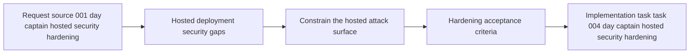

## item_001_day_captain_hosted_security_hardening - Harden the hosted Day Captain deployment path
> From version: 0.1.0
> Status: Done
> Understanding: 99%
> Confidence: 97%
> Progress: 100%
> Complexity: High
> Theme: Security
> Reminder: Update status/understanding/confidence/progress and linked task references when you edit this doc.

# Problem
- The current Render + GitHub Actions deployment path is functionally usable but not yet secure enough for a serious hosted rollout.
- The main risks are not in Graph access itself but in the hosting and operations layer:
  - digest content can leak through GitHub Actions job output
  - hosted job endpoints can be misconfigured without mandatory protection
  - HTTP error handling can expose internal details
  - the current web runtime is minimal and not hardened for production serving
  - hosted delegated token handling still assumes a file-cache model that is acceptable locally but weak in a hosted environment
- Without an explicit hardening slice, the project risks shipping a working deployment path that leaks mailbox-derived data or exposes privileged trigger endpoints.

# Scope
- In:
  - remove digest/body leakage from scheduled trigger logs
  - make hosted trigger authentication mandatory and explicit
  - reduce hosted HTTP response detail on failures
  - move the hosted runtime to a production-serving process model
  - define safer hosted token/secrets handling expectations
  - document secure hosted database and secret requirements
- Out:
  - redesign of digest ranking/scoring rules
  - multi-user auth redesign
  - replacing Microsoft Graph or Entra ID in V1
  - enterprise compliance tooling beyond the immediate hosted path

# Acceptance criteria
- AC1: The scheduled trigger path does not emit digest bodies, mailbox previews, or mailbox-derived metadata into GitHub Actions logs during normal successful runs.
- AC2: Hosted job endpoints cannot run unprotected in non-development environments; startup or request handling fails closed when required security settings are missing.
- AC3: Hosted HTTP responses return minimal acknowledgements for job triggers and do not expose raw internal exception strings.
- AC4: The hosted web runtime uses a production-serving process model instead of the standard-library development server.
- AC5: Hosted token handling is no longer based on the local plaintext file-cache default for the deployed service path.
- AC6: Hosted database and secret configuration explicitly require secure transport and clearly separate local-development defaults from hosted-production expectations.
- AC7: The hardening changes keep the existing single-user Graph digest flow working for local development and automated tests.
- AC8: The hosted hardening path is validated by automated tests plus a concrete deployment checklist.

# AC Traceability
- AC1 -> Scope includes scheduler log hygiene. Proof: item requires removing digest/body leakage from scheduled triggers.
- AC2 -> Scope includes mandatory trigger protection. Proof: item requires hosted trigger auth to fail closed.
- AC3 -> Scope includes safer HTTP behavior. Proof: item requires minimal acknowledgements and reduced error detail.
- AC4 -> Scope includes runtime hardening. Proof: item requires replacing the current development-grade serving model.
- AC5 -> Scope includes hosted token-handling hardening. Proof: item calls out file-cache assumptions as insufficient in hosted mode.
- AC6 -> Scope includes secure hosted config boundaries. Proof: item requires explicit hosted DB and secret expectations.
- AC7 -> Scope preserves current app behavior. Proof: item explicitly keeps local development and tests in bounds.
- AC8 -> Scope includes validation. Proof: item requires both automated coverage and deployment checklist validation.

# Links
- Request: `req_001_day_captain_hosted_security_hardening`
- Primary task(s): `task_004_day_captain_hosted_security_hardening`

# Priority
- Impact: High - the current hosted path touches mailbox-derived data and privileged job triggers.
- Urgency: High - the project now has a deployment scaffold, so security gaps are no longer theoretical.

# Notes
- Derived from request `req_001_day_captain_hosted_security_hardening`.
- This slice is intentionally narrow: it hardens the existing Render/GitHub Actions deployment path instead of reopening architecture choices.
- The likely implementation areas are `src/day_captain/web.py`, `.github/workflows/morning-digest-scheduler.yml`, token storage behavior, runtime/deploy config, and hosted deployment documentation.
