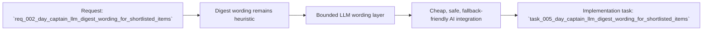

## item_002_day_captain_llm_digest_wording_for_shortlisted_items - Add an LLM wording layer on top of deterministic digest scoring
> From version: 0.2.0
> Status: Ready
> Understanding: 96%
> Confidence: 95%
> Progress: 0%
> Complexity: High
> Theme: AI
> Reminder: Update status/understanding/confidence/progress and linked task references when you edit this doc.

# Problem
- Day Captain already decides what matters, but it still explains those decisions with rigid heuristic summaries.
- That leaves a visible product gap: the system behaves like a prioritizer, not yet like an assistant with clean digest wording.
- The project already constrained V1 toward low-cost LLM usage on shortlisted items only, so the missing work is not exploratory research anymore; it is a focused implementation slice.
- Without an explicit backlog item for this gap, the repo risks shipping a complete ingestion/scoring/hosting pipeline while still missing the AI layer that makes the digest feel meaningfully more useful to the user.

# Scope
- In:
  - introduce a summarizer abstraction that rewrites shortlisted digest-item summaries after deterministic scoring
  - add environment-driven provider/model/key/timeout/usage-budget settings
  - implement a first OpenAI-compatible provider path using a simple HTTP adapter
  - preserve deterministic fallback behavior when the AI layer is disabled or failing
  - keep section membership, source identifiers, and critical-topic guardrails unchanged
  - add tests and docs for the new wording layer
- Out:
  - model-driven ranking or suppression of items
  - full-email summarization outside the shortlist
  - agentic workflows, tool calling, or outbound actions
  - multi-provider orchestration beyond a first provider-compatible integration

# Acceptance criteria
- AC1: The wording layer consumes only already-prioritized digest items and operates on a bounded shortlist.
- AC2: The app continues producing a valid digest when the LLM provider is unavailable or disabled.
- AC3: The first provider path is configurable entirely through settings and secrets rather than hardcoded values.
- AC4: The wording layer cannot change an item's section, source kind/source ID, or guardrail flag.
- AC5: The integration keeps usage bounded through shortlist and completion limits suitable for one or a few requests per day.
- AC6: The provider adapter gracefully handles malformed model output and falls back instead of breaking the morning run.
- AC7: The implementation fits both local development and hosted Render deployment without introducing a heavy runtime dependency.
- AC8: The new slice is validated by automated tests and linked docs.

# AC Traceability
- AC1 -> Scope constrains prompting to shortlisted items. Proof: item explicitly forbids full-mailbox summarization.
- AC2 -> Scope requires deterministic fallback. Proof: item keeps digest success independent from LLM availability.
- AC3 -> Scope requires explicit settings. Proof: item calls for environment-driven provider and secret configuration.
- AC4 -> Scope preserves the deterministic decision layer. Proof: item keeps section/source/guardrail ownership outside the LLM.
- AC5 -> Scope constrains cost. Proof: item requires shortlist and completion limits.
- AC6 -> Scope constrains runtime failure handling. Proof: item requires graceful fallback on malformed or failed model responses.
- AC7 -> Scope constrains implementation style. Proof: item requires compatibility with local and hosted execution without heavy SDK coupling.
- AC8 -> Scope includes validation and docs. Proof: item explicitly requires tests and documentation updates.

# Links
- Request: `req_002_day_captain_llm_digest_wording_for_shortlisted_items`
- Primary task(s): `task_005_day_captain_llm_digest_wording_for_shortlisted_items`

# Priority
- Impact: High - this is the missing user-facing AI layer in the core morning digest experience.
- Urgency: Medium - the platform is functional today, but the intended V1 quality bar is not met until wording improves.

# Notes
- Derived from request `req_002_day_captain_llm_digest_wording_for_shortlisted_items`.
- This slice intentionally keeps scoring deterministic and treats the LLM as a wording pass, not a decision maker.
- Likely implementation areas are `src/day_captain/config.py`, `src/day_captain/app.py`, a new LLM adapter module, `src/day_captain/services.py`, `.env.example`, `README.md`, and focused tests.
- The implementation should depend on `task_002_day_captain_digest_scoring_recall_and_delivery` and align with the hosted configuration conventions hardened in `task_004_day_captain_hosted_security_hardening`.
