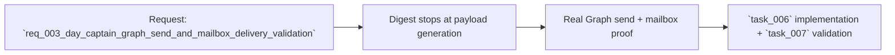

## item_003_day_captain_graph_send_and_mailbox_delivery_validation - Deliver the digest into Outlook and validate real mailbox receipt
> From version: 0.3.0
> Status: Done
> Understanding: 99%
> Confidence: 98%
> Progress: 100%
> Complexity: High
> Theme: Delivery
> Reminder: Update status/understanding/confidence/progress and linked task references when you edit this doc.

# Problem
- Day Captain can currently read Outlook data and build a `graph_send` payload, but it cannot yet complete the last mile by sending the digest into Outlook through Microsoft Graph.
- That leaves a visible product gap: the app can decide what to send, but cannot yet prove the intended delivery experience in the real mailbox.
- The missing work spans both implementation and validation:
  - a code slice must call Graph `sendMail`
  - a manual delegated-auth validation slice must confirm that the message is actually received in the mailbox

# Scope
- In:
  - add real delegated Graph mail sending for the existing digest payload
  - make `Mail.Send` and send-mode prerequisites explicit in config and docs
  - validate request construction, failure behavior, and mailbox receipt
  - keep the existing `json` mode and non-send flows working
- Out:
  - email template redesign
  - attachment support
  - advanced retry or outbox architecture
  - multi-recipient or multi-tenant delivery policies

# Acceptance criteria
- AC1: The delivery layer issues a real delegated Graph send request when `delivery_mode=graph_send`.
- AC2: Send prerequisites are explicit and validated, including the need for delegated `Mail.Send`.
- AC3: The app preserves `json` mode and other non-send flows unchanged when send mode is not requested.
- AC4: Automated tests cover request shaping and send-path behavior.
- AC5: Manual validation confirms a digest reaches the real mailbox.
- AC6: The send implementation remains compatible with current local and hosted deployment assumptions.
- AC7: Documentation covers config, auth refresh, and validation steps for the send path.
- AC8: The work is split into separate implementation and real-validation tasks.

# AC Traceability
- AC1 -> Scope includes real Graph delivery. Proof: item explicitly requires delegated send execution.
- AC2 -> Scope includes prerequisite clarity. Proof: item explicitly calls out `Mail.Send` and send-mode requirements.
- AC3 -> Scope preserves existing behavior. Proof: item keeps `json` mode and non-send flows in bounds.
- AC4 -> Scope includes automated coverage. Proof: item explicitly requires request-shaping and behavior tests.
- AC5 -> Scope includes real-world proof. Proof: item explicitly requires mailbox receipt validation.
- AC6 -> Scope preserves deployment fit. Proof: item keeps current local and hosted assumptions in scope.
- AC7 -> Scope includes documentation. Proof: item explicitly requires config/auth/validation docs.
- AC8 -> Scope separates implementation from external proof. Proof: item explicitly splits the work into two tasks.

# Links
- Request: `req_003_day_captain_graph_send_and_mailbox_delivery_validation`
- Primary task(s): `task_006_day_captain_graph_send_delivery_execution`, `task_007_day_captain_mailbox_delivery_end_to_end_validation`

# Priority
- Impact: High - this is the missing last-mile proof that the digest can land where the user actually works.
- Urgency: High - the user explicitly wants mailbox delivery testing now, not only local payload generation.

# Notes
- Derived from request `req_003_day_captain_graph_send_and_mailbox_delivery_validation`.
- This slice intentionally separates local code implementation from external mailbox validation because delegated auth scope and real delivery proof are not purely unit-test concerns.
- `task_006_day_captain_graph_send_delivery_execution` is now implemented: delegated Graph send execution, guardrails, docs, and automated tests are in place.
- `task_007_day_captain_mailbox_delivery_end_to_end_validation` is now complete: delegated auth was refreshed with `Mail.Send`, a real send was executed, and mailbox receipt was verified through Graph readback.
- Implemented areas include `src/day_captain/adapters/graph.py`, `src/day_captain/app.py`, `.env.example`, `README.md`, and focused tests.
