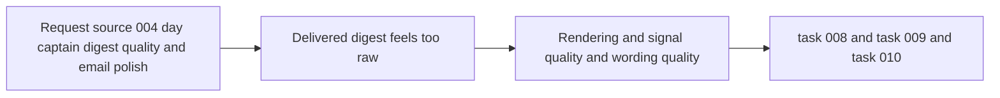

## item_004_day_captain_digest_quality_and_email_polish - Improve delivered digest quality after real mailbox validation
> From version: 0.4.0
> Status: In Progress
> Understanding: 100%
> Confidence: 97%
> Progress: 92%
> Complexity: High
> Theme: Quality
> Reminder: Update status/understanding/confidence/progress and linked task references when you edit this doc.

# Problem
- Day Captain can now deliver a real Outlook digest, but the received email still feels like an internal payload rather than a polished assistant output.
- The user-visible weaknesses are concentrated in three areas:
  - rendering quality
  - signal quality
  - wording quality
- Without a dedicated quality slice, the product risks appearing technically complete while still feeling weak in daily use.

# Scope
- In:
  - improve delivered email formatting and readability
  - reduce weak watch items and low-value digest noise
  - exercise and tune the existing bounded LLM wording path for actual delivered digests
  - validate improvements against real delivered mailbox output
- Out:
  - non-email UI work
  - multi-user workflow design
  - broad model-based ranking across all mailbox inputs
  - autonomous actions beyond digest delivery

# Acceptance criteria
- AC1: Delivered digest formatting is meaningfully improved for Outlook readability.
- AC2: Timestamp and section presentation are human-friendly rather than raw internal formatting.
- AC3: Weak or low-value watch items are reduced through filtering/prioritization refinement.
- AC4: Bounded LLM wording can be enabled and tuned for delivered digests with deterministic fallback preserved.
- AC5: Improvements are validated against real mailbox-delivered digests.
- AC6: `json` mode compatibility is preserved while improving `graph_send` output quality.
- AC7: Cost/complexity stays within the existing bounded-LLM design.
- AC8: The slice is broken into concrete tasks for rendering, signal tuning, and wording tuning.

# AC Traceability
- AC1 -> Scope includes rendering quality. Proof: item explicitly requires delivered email formatting improvements.
- AC2 -> Scope includes presentation polish. Proof: item explicitly requires human-friendly timestamps and structure.
- AC3 -> Scope includes signal quality. Proof: item explicitly requires reducing weak digest items.
- AC4 -> Scope includes bounded LLM tuning. Proof: item explicitly requires configuring and tuning delivered wording while preserving fallback.
- AC5 -> Scope includes real-world proof. Proof: item explicitly requires validation against mailbox-delivered output.
- AC6 -> Scope preserves delivery compatibility. Proof: item explicitly keeps `json` and `graph_send` in bounds.
- AC7 -> Scope preserves bounded cost. Proof: item explicitly limits work to the current bounded LLM design.
- AC8 -> Scope decomposes into implementation tasks. Proof: item explicitly maps to three separate tasks.

# Links
- Request: `req_004_day_captain_digest_quality_and_email_polish`
- Primary task(s): `task_008_day_captain_email_rendering_and_formatting_upgrade` (`Done`), `task_009_day_captain_digest_signal_quality_tuning` (`Done`), `task_010_day_captain_llm_digest_wording_activation_and_tuning` (`In Progress`)

# Priority
- Impact: High - this is now the main blocker between a working pipeline and a genuinely useful assistant experience.
- Urgency: High - the weakness is visible in every delivered digest.

# Notes
- Derived from request `req_004_day_captain_digest_quality_and_email_polish`.
- This slice starts from a real received email, not a speculative design exercise.
- Likely implementation areas include `src/day_captain/services.py`, `src/day_captain/app.py`, `.env`, `.env.example`, `README.md`, and the digest-related tests.
- Rendering and signal quality are implemented and validated against real `graph_send` delivery.
- Remaining work is limited to end-to-end mailbox validation of the LLM wording path once provider quota or billing is enabled; the configured key currently falls back on `429 insufficient_quota`.
