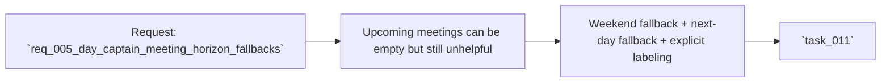

## item_005_day_captain_meeting_horizon_fallbacks - Improve meeting section usefulness with weekend and next-day fallbacks
> From version: 0.5.0
> Status: Done
> Understanding: 100%
> Confidence: 98%
> Progress: 100%
> Complexity: Medium
> Theme: Productivity
> Reminder: Update status/understanding/confidence/progress and linked task references when you edit this doc.

# Problem
- The `Upcoming meetings` section can be empty in situations where the user still needs near-term calendar visibility.
- Two concrete cases matter:
  - on Saturday or Sunday, the relevant planning horizon is Monday
  - on a given day with no meetings, the next day's meetings are often more useful than an empty section
- Without these fallbacks, the digest feels literal rather than assistant-like in its handling of calendar context.

# Scope
- In:
  - choose Monday as the displayed meeting horizon when the digest runs on a weekend
  - choose the next day as the displayed meeting horizon when the current day has no meetings
  - make the rendered section explicitly state which day is being shown
  - preserve current-day behavior when meetings exist
- Out:
  - multi-day agenda views
  - meeting summarization beyond the selected day
  - changes to non-meeting sections
  - ranking logic outside meeting-window selection

# Acceptance criteria
- AC1: Weekend runs display Monday meetings.
- AC2: Weekend fallback is explicitly labeled in the digest output.
- AC3: Empty same-day meeting windows fall back to next-day meetings.
- AC4: Next-day fallback is explicitly labeled in the digest output.
- AC5: Existing same-day meeting rendering remains unchanged when same-day meetings exist.
- AC6: Delivery compatibility with `json` and `graph_send` is preserved.
- AC7: Tests cover weekend fallback, empty-day fallback, and same-day no-op behavior.

# AC Traceability
- AC1 -> Scope includes Monday fallback. Proof: item explicitly requires weekend meeting substitution.
- AC2 -> Scope includes explicit wording. Proof: item explicitly requires the rendered section to name the shown day.
- AC3 -> Scope includes next-day fallback. Proof: item explicitly requires using the next day when the current day is empty.
- AC4 -> Scope includes explicit wording. Proof: item explicitly requires the rendered section to identify the fallback day.
- AC5 -> Scope preserves standard behavior. Proof: item explicitly keeps same-day rendering unchanged when meetings exist.
- AC6 -> Scope preserves delivery compatibility. Proof: item explicitly keeps both delivery modes in bounds.
- AC7 -> Scope includes automated proof. Proof: item explicitly requires test coverage for the three main cases.

# Links
- Request: `req_005_day_captain_meeting_horizon_fallbacks`
- Primary task(s): `task_011_day_captain_meeting_horizon_fallbacks` (`Done`)

# Priority
- Impact: Medium - this improves day-to-day usefulness of the meeting section without changing the rest of the digest.
- Urgency: Medium - the rule is straightforward and directly user-requested.

# Notes
- Derived from request `req_005_day_captain_meeting_horizon_fallbacks`.
- Likely implementation areas include `src/day_captain/services.py`, digest rendering tests, and delivery contract tests.
- Weekend runs now preview Monday meetings, same-day empty windows fall back to the next day, and the rendered digest explicitly names the fallback horizon.
- Validation covered unit tests, full test suite, and a real `graph_send` run on Saturday, March 7, 2026 showing Monday meetings in the delivered digest.
