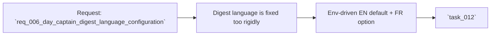

## item_006_day_captain_digest_language_configuration - Add env-driven language selection for digest rendering and wording
> From version: 0.5.0
> Status: Done
> Understanding: 100%
> Confidence: 98%
> Progress: 100%
> Complexity: Medium
> Theme: Localization
> Reminder: Update status/understanding/confidence/progress and linked task references when you edit this doc.

# Problem
- Day Captain currently behaves as an English-first product for rendered digest labels and wording assumptions.
- That creates friction for users who work primarily in another language and want the delivered digest to match that operating language.
- The missing capability is not a broad translation system; it is a controlled configuration layer that lets the product switch its own output language predictably.

# Scope
- In:
  - add a runtime language setting backed by `.env`
  - default to English when the setting is absent
  - support at least French as an alternate configured language
  - localize digest labels, explicit fallback wording, and LLM prompt language selection
  - preserve delivery compatibility and deterministic fallback behavior
- Out:
  - translating user mailbox content
  - automatic per-message language detection
  - general-purpose localization for an unlimited number of locales
  - non-digest UI translation work

# Acceptance criteria
- AC1: Language is configurable through env-backed settings.
- AC2: English remains the default when nothing is configured.
- AC3: French is supported as an alternate configured language.
- AC4: Digest labels and deterministic fallback wording honor the selected language.
- AC5: The LLM path honors the selected language.
- AC6: `json` and `graph_send` compatibility is preserved.
- AC7: Existing behavior remains safe when the LLM path is disabled or unavailable.
- AC8: Tests cover default English, configured French, and fallback safety.

# AC Traceability
- AC1 -> Scope includes env-backed configuration. Proof: item explicitly requires runtime language selection through `.env`.
- AC2 -> Scope preserves current default behavior. Proof: item explicitly requires English as the default.
- AC3 -> Scope includes at least one alternate language. Proof: item explicitly requires French support.
- AC4 -> Scope includes rendered labels and fallback wording. Proof: item explicitly requires deterministic output to honor the selected language.
- AC5 -> Scope includes LLM behavior. Proof: item explicitly requires the LLM path to honor the selected language.
- AC6 -> Scope preserves delivery compatibility. Proof: item explicitly keeps both delivery modes in bounds.
- AC7 -> Scope preserves deterministic safety. Proof: item explicitly preserves delivery compatibility and fallback behavior even without LLM availability.
- AC8 -> Scope includes automated proof. Proof: item explicitly requires focused tests for default, alternate language, and fallback behavior.

# Links
- Request: `req_006_day_captain_digest_language_configuration`
- Primary task(s): `task_012_day_captain_digest_language_configuration` (`Done`)

# Priority
- Impact: Medium - this materially improves usability for non-English operation without changing the core pipeline.
- Urgency: Medium - the capability is directly user-requested and low-risk.

# Notes
- Derived from request `req_006_day_captain_digest_language_configuration`.
- Likely implementation areas include `src/day_captain/config.py`, `src/day_captain/services.py`, `src/day_captain/adapters/llm.py`, `.env.example`, and digest-related tests.
- Runtime settings now expose `DAY_CAPTAIN_DIGEST_LANGUAGE` and `DAY_CAPTAIN_LLM_LANGUAGE`, with English default and French support.
- Validation included unit coverage, full test suite, an English `graph_send` run, and a French `json` run confirming localized digest labels and fallback wording.
