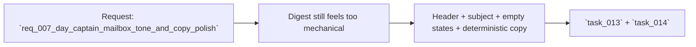

## item_007_day_captain_mailbox_tone_and_copy_polish - Remove the remaining system-report feel from the delivered digest
> From version: 0.5.0
> Status: Done
> Understanding: 100%
> Confidence: 98%
> Progress: 100%
> Complexity: Medium
> Theme: Quality
> Reminder: Update status/understanding/confidence/progress and linked task references when you edit this doc.

# Problem
- The delivered digest is now readable, but it still feels like a generated report rather than an assistant message a user would want to read every morning.
- The remaining friction is mostly copy-level:
  - technical header metadata
  - utilitarian subject line
  - empty states that say `None`
  - deterministic summaries that are still too close to raw source text
- Without this polish, the digest remains operationally useful but product-wise underwhelming.

# Scope
- In:
  - rewrite header and metadata phrasing to feel more user-facing
  - improve inbox subject wording
  - replace technical empty-state values with assistant-like copy
  - improve deterministic fallback wording without requiring LLM activation
  - validate improvements on a real delivered digest
- Out:
  - language switching itself, which is handled by `req_006_day_captain_digest_language_configuration`
  - weekend/next-day meeting fallback behavior, which is handled by `req_005_day_captain_meeting_horizon_fallbacks`
  - large ranking changes
  - non-email product surfaces

# Acceptance criteria
- AC1: Header and metadata wording becomes more assistant-like.
- AC2: Subject line becomes more natural in the inbox.
- AC3: Empty sections use non-technical assistant-style wording.
- AC4: Deterministic fallback summaries become more concise and user-facing.
- AC5: Real delivered validation confirms the tone improvement.
- AC6: `json` and `graph_send` compatibility is preserved.
- AC7: The digest remains safe and coherent without LLM availability.
- AC8: The work is split into separate tasks for header/subject polish and copy/empty-state polish.

# AC Traceability
- AC1 -> Scope includes header and metadata copy. Proof: item explicitly requires assistant-like header wording.
- AC2 -> Scope includes inbox subject wording. Proof: item explicitly requires a more natural email subject.
- AC3 -> Scope includes empty-state replacement. Proof: item explicitly requires replacing `None`-style output.
- AC4 -> Scope includes deterministic copy improvements. Proof: item explicitly improves fallback wording without requiring LLM activation.
- AC5 -> Scope includes mailbox proof. Proof: item explicitly requires validation on a real delivered digest.
- AC6 -> Scope preserves delivery compatibility. Proof: item explicitly keeps both delivery modes in scope.
- AC7 -> Scope preserves deterministic safety. Proof: item explicitly improves copy without depending on active LLM availability.
- AC8 -> Scope decomposes into multiple tasks. Proof: item explicitly maps to `task_013` and `task_014`.

# Links
- Request: `req_007_day_captain_mailbox_tone_and_copy_polish`
- Primary task(s): `task_013_day_captain_digest_header_and_subject_polish` (`Done`), `task_014_day_captain_digest_empty_states_and_fallback_copy_polish` (`Done`)

# Priority
- Impact: Medium - this directly affects daily perceived quality even though the pipeline already works.
- Urgency: Medium - the issue is visible in every delivered digest and was directly called out from a real mailbox review.

# Notes
- Derived from request `req_007_day_captain_mailbox_tone_and_copy_polish`.
- This slice complements `req_005` and `req_006` instead of replacing them.
- The digest now uses assistant-style header copy, a more natural inbox subject, non-technical empty states, and stronger deterministic fallback summaries.
- Real mailbox validation on Saturday, March 7, 2026 confirmed the delivered digest no longer reads like a raw internal report.
