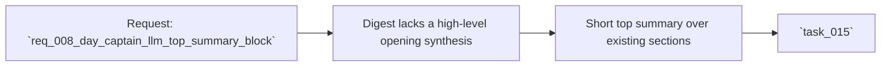

## item_008_day_captain_llm_top_summary_block - Add a short LLM-generated overview block above the detailed digest
> From version: 0.6.0
> Status: Ready
> Understanding: 99%
> Confidence: 98%
> Progress: 0%
> Complexity: Medium
> Theme: Quality
> Reminder: Update status/understanding/confidence/progress and linked task references when you edit this doc.

# Problem
- The digest now has better structure and copy, but it still starts directly with sections rather than an immediate executive summary.
- Item-level wording polish is useful, but it does not yet give the reader a true top-level synthesis of the day.
- A short overview block at the top would create more perceived assistant value without undermining the deterministic shortlist below.

# Scope
- In:
  - add a short top summary block above the detailed digest sections
  - synthesize only the final already-selected digest content
  - keep the summary bounded, factual, and short
  - preserve the detailed sections below as the authoritative content
  - preserve safe fallback behavior when LLM output is unavailable
- Out:
  - replacing detailed sections
  - long narrative summaries
  - LLM ranking over raw mailbox inputs
  - broad prompt chains or multi-call orchestration

# Acceptance criteria
- AC1: A short top summary block can be rendered above the detailed digest sections.
- AC2: The summary input is limited to the final digest content, not raw mailbox history.
- AC3: The summary stays bounded and concise.
- AC4: The detailed sections remain present and unchanged below the summary.
- AC5: Fallback behavior remains safe if the LLM is disabled or fails.
- AC6: `json` and `graph_send` compatibility is preserved.
- AC7: The implementation stays within the project's bounded-LLM cost constraints.
- AC8: Tests cover enabled, fallback, and placement behavior.

# AC Traceability
- AC1 -> Scope includes a rendered top block. Proof: item explicitly requires a short summary above the detailed digest.
- AC2 -> Scope bounds the input. Proof: item explicitly limits summary input to final digest content.
- AC3 -> Scope bounds the output. Proof: item explicitly requires a short concise overview.
- AC4 -> Scope preserves the sections. Proof: item explicitly keeps detailed sections as authoritative content.
- AC5 -> Scope preserves deterministic safety. Proof: item explicitly requires safe fallback when LLM output is unavailable.
- AC6 -> Scope preserves delivery compatibility. Proof: item explicitly keeps both delivery modes in bounds.
- AC7 -> Scope preserves bounded LLM usage. Proof: item explicitly constrains the feature to a short synthesis over final digest content rather than broad prompt expansion.
- AC8 -> Scope includes automated proof. Proof: item explicitly requires tests for enabled, fallback, and placement behavior.

# Links
- Request: `req_008_day_captain_llm_top_summary_block`
- Primary task(s): `task_015_day_captain_llm_top_summary_block`

# Priority
- Impact: Medium - this adds visible assistant value at the very top of the digest.
- Urgency: Medium - it is a strong UX improvement once the current digest flow is already stable.

# Notes
- Derived from request `req_008_day_captain_llm_top_summary_block`.
- This slice extends the bounded LLM strategy instead of replacing deterministic digest construction.
