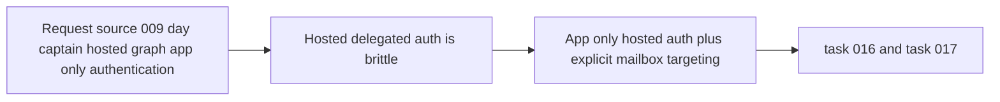

## item_009_day_captain_hosted_graph_app_only_authentication - Replace hosted delegated Graph refresh handling with app-only auth
> From version: 0.7.0
> Status: In Progress
> Understanding: 99%
> Confidence: 98%
> Progress: 50%
> Complexity: High
> Theme: Delivery
> Reminder: Update status/understanding/confidence/progress and linked task references when you edit this doc.

# Problem
- The current hosted deployment path boots on Render, but real digest execution fails because the service depends on delegated Graph refresh-token renewal.
- That hosted auth model is fragile for unattended execution and creates repeated manual operational work.
- Day Captain needs a service-grade hosted auth path that can read mailbox data and send the digest without a user-driven refresh-token lifecycle.

# Scope
- In:
  - add hosted Microsoft Graph app-only auth using client credentials
  - switch hosted Graph reads and sends to explicit `/users/{id}` routes
  - preserve delegated local auth for CLI and local testing
  - make hosted env vars and required Graph application permissions explicit
  - validate the hosted flow after deployment
- Out:
  - removing delegated auth from local development
  - multi-mailbox orchestration
  - certificate auth as a mandatory V1 prerequisite
  - non-Graph delivery models

# Acceptance criteria
- AC1: Hosted Graph authentication no longer depends on delegated refresh tokens.
- AC2: Hosted Graph operations use an explicit target mailbox identity.
- AC3: Local delegated auth remains intact for local workflows.
- AC4: Hosted env-var and Graph-permission requirements are documented explicitly.
- AC5: Automated tests cover hosted app-only auth and route selection behavior.
- AC6: Hosted validation proves that Render can execute the digest end to end.
- AC7: The migration fits the existing delivery architecture without changing the digest contract.
- AC8: The work is split into separate implementation and deployed-validation tasks.

# AC Traceability
- AC1 -> Scope includes app-only auth. Proof: item explicitly replaces hosted delegated refresh handling with client-credentials auth.
- AC2 -> Scope includes explicit mailbox targeting. Proof: item explicitly requires `/users/{id}` routes for hosted Graph operations.
- AC3 -> Scope preserves local behavior. Proof: item explicitly keeps delegated local auth in bounds.
- AC4 -> Scope includes documentation. Proof: item explicitly requires hosted env vars and Graph permissions to be made explicit.
- AC5 -> Scope includes automated coverage. Proof: item explicitly requires tests for auth mode and route selection.
- AC6 -> Scope includes deployed proof. Proof: item explicitly requires hosted validation after deployment.
- AC7 -> Scope preserves architecture fit. Proof: item explicitly keeps the existing digest contract and delivery modes.
- AC8 -> Scope separates code and deployed proof. Proof: item explicitly maps to separate implementation and validation tasks.

# Links
- Request: `req_009_day_captain_hosted_graph_app_only_authentication`
- Primary task(s): `task_016_day_captain_hosted_graph_app_only_authentication_implementation` (`Done`), `task_017_day_captain_hosted_graph_app_only_authentication_validation` (`Ready`)

# Priority
- Impact: High - this is the cleanest path to a stable hosted deployment.
- Urgency: High - the current hosted delegated auth flow is the main operational blocker for Render-based execution.

# Notes
- Derived from request `req_009_day_captain_hosted_graph_app_only_authentication`.
- This slice intentionally keeps local delegated auth because it still provides the best developer ergonomics for local mailbox testing.
- `task_016_day_captain_hosted_graph_app_only_authentication_implementation` is complete: hosted app-only auth, explicit `/users/{id}` routing, and supporting tests/docs are now in place.
- `task_017_day_captain_hosted_graph_app_only_authentication_validation` remains open for Render-hosted proof against the deployed service.
