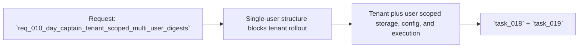

## item_010_day_captain_tenant_scoped_multi_user_digests - Introduce bounded tenant-scoped multi-user digest operation
> From version: 0.7.0
> Status: Ready
> Understanding: 99%
> Confidence: 97%
> Progress: 0%
> Complexity: High
> Theme: Product
> Reminder: Update status/understanding/confidence/progress and linked task references when you edit this doc.

# Problem
- Day Captain is still structurally single-user: one mailbox identity, one execution context, and one shared persistence space.
- That makes the current product unsuitable for safely serving several people from one company tenant in one deployment.
- The next useful step is not a full SaaS platform, but a bounded operator-managed model where one tenant configuration can serve several users with strict isolation.

# Scope
- In:
  - add stable tenant and user/account scopes to stored product data
  - support tenant-scoped multi-user configuration and per-user digest execution
  - require an explicit target-user list so only selected users receive digests
  - preserve current digest behavior while making runs, delivery, and recall tenant-aware and user-aware
  - validate that data and outputs remain isolated across users
  - clean up `.env*` and config docs so the tenant-scoped model is explicit and obsolete single-user settings do not mislead operators
  - document the initial tenant-scoped multi-user operating model
- Out:
  - self-service onboarding
  - full tenant-administration UX
  - arbitrary marketplace-scale SaaS concerns
  - replacing the digest product contract itself

# Acceptance criteria
- AC1: Stored data is partitioned by tenant and user scope.
- AC2: A digest run can be executed for one configured user inside a tenant without cross-user leakage.
- AC3: Multiple users can be configured inside one tenant deployment without code edits, but only explicitly targeted users receive digests.
- AC4: Delivery and recall are tenant-aware and user-aware.
- AC5: Tests cover isolation and user-targeted execution.
- AC6: Docs explain the bounded tenant-scoped operator-managed model and the explicit target-user concept.
- AC7: The design stays compatible with hosted app-only auth.
- AC8: Implementation and validation stay separated.
- AC9: `.env*` and config docs are cleaned up for the tenant-scoped model.

# AC Traceability
- AC1 -> Scope includes tenant and user/account scoping. Proof: item explicitly introduces stable tenant and user scopes across stored product data.
- AC2 -> Scope includes per-user digest execution. Proof: item explicitly requires isolated execution by configured user inside a tenant.
- AC3 -> Scope includes tenant-scoped multi-user configuration. Proof: item explicitly requires several users to be configurable without code edits and only targeted users to receive digests.
- AC4 -> Scope includes tenant-aware and user-aware delivery and recall. Proof: item explicitly requires current digest behaviors to become tenant-scoped and user-scoped.
- AC5 -> Scope includes validation. Proof: item explicitly requires isolation-focused automated coverage.
- AC6 -> Scope includes operational docs. Proof: item explicitly requires documentation of the initial operating model and target-user selection.
- AC7 -> Scope preserves architectural direction. Proof: item explicitly keeps compatibility with hosted app-only auth.
- AC8 -> Scope maps to two tasks. Proof: item explicitly separates implementation from validation/documentation.
- AC9 -> Scope includes config cleanup. Proof: item explicitly requires `.env*` and config docs cleanup for the tenant-scoped model.

# Links
- Request: `req_010_day_captain_tenant_scoped_multi_user_digests`
- Primary task(s): `task_018_day_captain_tenant_scoped_multi_user_foundations_and_execution`, `task_019_day_captain_tenant_scoped_multi_user_validation_and_ops_documentation`

# Priority
- Impact: High - this is the gateway from a personal prototype to a reusable team product.
- Urgency: High - the current single-user assumption is now a product blocker.

# Notes
- Derived from request `req_010_day_captain_tenant_scoped_multi_user_digests`.
- This slice deliberately targets an operator-managed deployment first, not a public SaaS control plane.
