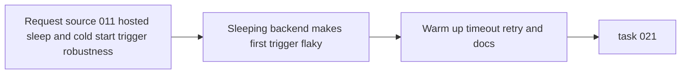

## item_011_day_captain_hosted_sleep_and_cold_start_trigger_robustness - Make hosted triggering resilient to sleeping or cold-starting services
> From version: 0.8.0
> Status: In Progress
> Understanding: 99%
> Confidence: 98%
> Progress: 0%
> Complexity: Medium
> Theme: Reliability
> Reminder: Update status/understanding/confidence/progress and linked task references when you edit this doc.

# Problem
- The hosted Day Captain service may be asleep or slow to start when the external scheduler sends the first request of the morning.
- In that state, a single direct job trigger can fail for operational reasons even when the app itself is healthy.
- That creates flaky morning runs, noisy ops behavior, and avoidable false alarms for a path that should be routine.
- The product still prefers an always-on paid service for serious production use, but the tooling and runbooks should be more tolerant of cold starts when sleep cannot be avoided.

# Scope
- In:
  - add wake-up-aware hosted validation and trigger behavior
  - support longer timeouts and bounded retries for sleeping-service startup latency
  - define a safe warm-up or readiness sequence before the real job trigger
  - document the difference between recommended always-on production hosting and sleeping-service fallback operation
  - keep compatibility with explicit target-user fan-out from the private ops repo
- Out:
  - replacing the hosting provider
  - turning the product into a queue-based worker system
  - promising perfect reliability on sleeping free infrastructure
  - changing digest semantics, Graph auth architecture, or mailbox content rules

# Acceptance criteria
- AC1: Hosted trigger tooling has an explicit wake-up-aware sequence before the real job trigger when needed.
- AC2: Timeout and retry behavior for cold-start scenarios are configurable and bounded.
- AC3: The robustness path reduces false scheduler failures without exposing digest content in logs or responses.
- AC4: Docs explain when to prefer always-on hosting and how to operate safely when the service may sleep.
- AC5: Automated tests cover delayed availability, timeout behavior, and wake-up sequencing.
- AC6: The design remains compatible with app-only hosted auth, private ops scheduling, and explicit per-user triggers.
- AC7: The slice stays narrowly operational and does not reopen the digest contract itself.

# AC Traceability
- AC1 -> Scope includes wake-up-aware triggering. Proof: item explicitly requires a safe warm-up or readiness sequence before the real job trigger.
- AC2 -> Scope includes bounded timeout/retry policy. Proof: item explicitly requires longer timeouts and bounded retries for sleeping-service startup latency.
- AC3 -> Scope preserves secure logging behavior. Proof: item explicitly requires reduced false failures without reintroducing digest leakage.
- AC4 -> Scope includes operator guidance. Proof: item explicitly distinguishes recommended always-on hosting from sleeping-service fallback operation.
- AC5 -> Scope includes automated validation. Proof: item explicitly requires delayed-availability and wake-up sequencing coverage.
- AC6 -> Scope preserves current hosted direction. Proof: item explicitly keeps compatibility with app-only auth, private ops scheduling, and explicit target-user fan-out.
- AC7 -> Scope stays narrow. Proof: item explicitly excludes digest-contract and auth-architecture redesign.

# Links
- Request: `req_011_day_captain_hosted_sleep_and_cold_start_trigger_robustness`
- Primary task(s): `task_021_day_captain_hosted_sleep_and_cold_start_trigger_robustness`

# Priority
- Impact: Medium - the core app can work, but scheduler reliability degrades sharply when the hosted service sleeps.
- Urgency: Medium - this becomes important as soon as the deployment is expected to run unattended on a sleeping plan.

# Notes
- Derived from request `req_011_day_captain_hosted_sleep_and_cold_start_trigger_robustness`.
- This slice is intentionally operational: it improves hosted trigger resilience without pretending sleeping infrastructure is equivalent to always-on hosting.
- The likely implementation areas are `src/day_captain/hosted_jobs.py`, `src/day_captain/cli.py`, the example scheduler workflow, and the private-ops deployment docs.
