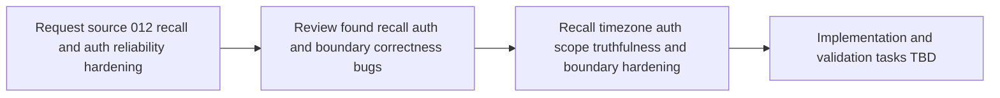

## item_012_day_captain_recall_and_auth_reliability_hardening - Harden recall correctness, auth scope truthfulness, and window boundaries
> From version: 0.9.0
> Status: Ready
> Understanding: 99%
> Confidence: 99%
> Progress: 0%
> Complexity: Medium
> Theme: Reliability
> Reminder: Update status/understanding/confidence/progress and linked task references when you edit this doc.

# Problem
- The project review uncovered several correctness bugs in areas that should be operationally trustworthy: digest recall, delegated auth scope validation, and message collection boundaries.
- These defects are easy to miss because the main happy-path test suite still passes, but they can break recall flows, misreport send readiness, or duplicate items across runs in real usage.
- The product now needs a focused reliability-hardening slice before these issues spread into hosted operations and user-facing trust erosion.

# Scope
- In:
  - fix recall by explicit `run_id` so persisted runs can be found reliably without redundant caller scoping
  - align recall-by-day behavior with the configured display timezone instead of raw UTC date matching
  - make delegated auth report and validate the scopes actually present on the active cached or refreshed token
  - remove exact-boundary duplicate ingestion across consecutive message collection windows
  - add automated regression coverage for these reviewed defects across in-memory and persisted storage semantics
- Out:
  - redesigning digest wording or scoring
  - changing the digest product contract
  - replacing Graph auth modes or storage backends
  - broader hosted-ops work unrelated to the review findings

# Acceptance criteria
- AC1: `recall_digest(run_id=...)` returns the correct persisted run without requiring a redundant explicit target user.
- AC2: `recall_digest(day=...)` uses the configured display timezone semantics for day resolution.
- AC3: Delegated auth truthfully reflects the scopes available on the active token so send prerequisites cannot pass on a false positive.
- AC4: Consecutive runs do not re-ingest a message received exactly on the previous run boundary.
- AC5: Automated tests cover explicit run-id recall, non-UTC day recall, narrow cached-token scopes, and exact-boundary timestamps.
- AC6: Tenant-scoped and user-scoped isolation remain intact after the fixes.
- AC7: The slice stays narrowly focused on reliability hardening rather than new product capability.

# AC Traceability
- AC1 -> Scope includes explicit run-id recall correctness. Proof: item explicitly fixes persisted-run lookup without redundant caller scoping.
- AC2 -> Scope includes timezone-aligned recall semantics. Proof: item explicitly replaces raw UTC day matching with display-timezone-consistent behavior.
- AC3 -> Scope includes delegated scope truthfulness. Proof: item explicitly requires auth to report and validate the scopes actually present on the active token.
- AC4 -> Scope includes boundary hardening. Proof: item explicitly removes exact-boundary duplicate ingestion across consecutive collection windows.
- AC5 -> Scope includes regression coverage. Proof: item explicitly requires tests for all review findings.
- AC6 -> Scope preserves isolation guarantees. Proof: item explicitly applies fixes across in-memory and persisted tenant/user-scoped storage semantics.
- AC7 -> Scope stays narrow. Proof: item explicitly excludes scoring, wording, contract, and architecture redesign.

# Links
- Request: `req_012_day_captain_recall_and_auth_reliability_hardening`
- Primary task(s): `task_022_day_captain_recall_and_delivery_evolution_orchestration` (`Ready`)

# Priority
- Impact: High - these defects affect trust in recall, send readiness, and digest continuity.
- Urgency: High - the bugs are already present and at least two were reproduced directly during review.

# Notes
- Derived from request `req_012_day_captain_recall_and_auth_reliability_hardening`.
- This slice comes directly from the project review and should be treated as corrective work, not roadmap expansion.
- The most immediate risks are user-facing recall failures and misleading `Mail.Send` readiness validation when a delegated token cache is stale relative to current config.
