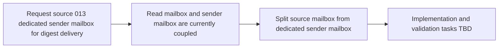

## item_013_day_captain_dedicated_sender_mailbox_for_digest_delivery - Decouple digest sender mailbox from the source mailbox
> From version: 0.9.0
> Status: Done
> Understanding: 100%
> Confidence: 98%
> Progress: 99%
> Complexity: Medium
> Theme: Delivery
> Reminder: Update status/understanding/confidence/progress and linked task references when you edit this doc.

# Problem
- Day Captain currently uses one mailbox identity for both reading source data and sending the final digest.
- That coupling blocks a cleaner delivery model where the digest is built from a user's mailbox but sent from a dedicated identity such as `daycaptain@company.com`.
- A dedicated sender mailbox is now desirable for branding, operator control, and cleaner recipient experience, especially since a shared mailbox for `daycaptain` already exists.

# Scope
- In:
  - introduce a distinct sender mailbox identity for Outlook delivery
  - preserve source mailbox targeting for message and meeting collection
  - require explicit recipients so delivery does not fall back to the sender mailbox implicitly
  - document the Microsoft 365 and configuration prerequisites for a dedicated sender mailbox, including the shared-mailbox option
  - validate the end-to-end path where a digest is built from one mailbox and sent from another
- Out:
  - delegated local auth sending as an arbitrary unrelated user
  - per-user branding or complex sender-routing policies
  - broad Exchange administration features beyond what is needed to ship the main path
  - unrelated mailbox-content, scoring, or recall changes

# Acceptance criteria
- AC1: Hosted Day Captain can read from one mailbox identity and send from another within the same tenant.
- AC2: Delivery config supports an explicit dedicated sender mailbox identity.
- AC3: Graph route selection uses the source mailbox for reads and the sender mailbox for `sendMail`.
- AC4: Delivery recipients remain explicit and do not silently collapse to the sender mailbox.
- AC5: Automated tests cover source/sender route separation and recipient construction.
- AC6: Docs explain the shared-mailbox option and its operational/licensing constraints.
- AC7: A validation path proves real delivery from the dedicated sender mailbox to the target user inbox.
- AC8: The design remains compatible with tenant-scoped multi-user hosted execution and app-only Graph auth.

# AC Traceability
- AC1 -> Scope includes sender/source split. Proof: item explicitly introduces a distinct sender mailbox while preserving source mailbox targeting.
- AC2 -> Scope includes configuration support. Proof: item explicitly requires a dedicated sender mailbox identity in delivery configuration.
- AC3 -> Scope includes Graph route separation. Proof: item explicitly preserves source-targeted reads while introducing sender-targeted `sendMail`.
- AC4 -> Scope includes explicit recipients. Proof: item explicitly forbids implicit fallback to the sender mailbox.
- AC5 -> Scope includes automated validation. Proof: item explicitly requires tests for route separation and recipient construction.
- AC6 -> Scope includes operator docs. Proof: item explicitly requires shared-mailbox prerequisites and constraints to be documented.
- AC7 -> Scope includes real validation. Proof: item explicitly requires end-to-end proof from dedicated sender mailbox to target inbox.
- AC8 -> Scope preserves current hosted architecture. Proof: item explicitly keeps compatibility with app-only auth and tenant-scoped multi-user execution.

# Links
- Request: `req_013_day_captain_dedicated_sender_mailbox_for_digest_delivery`
- Primary task(s): `task_022_day_captain_recall_and_delivery_evolution_orchestration` (`Done`)

# Priority
- Impact: Medium - the product works without it, but delivery identity quality and operator control are constrained.
- Urgency: Medium - the dedicated shared mailbox now exists, so the feature has become immediately actionable.

# Notes
- Derived from request `req_013_day_captain_dedicated_sender_mailbox_for_digest_delivery`.
- This slice is primarily a delivery-routing evolution for hosted app-only operation.
- The likely implementation will touch config, auth context or delivery routing, Graph send behavior, and hosted validation docs.
- Closed on Sunday, March 8, 2026 through `task_022_day_captain_recall_and_delivery_evolution_orchestration`, with real hosted validation showing `configured_sender_user=daycaptain@company.com` on Render.
