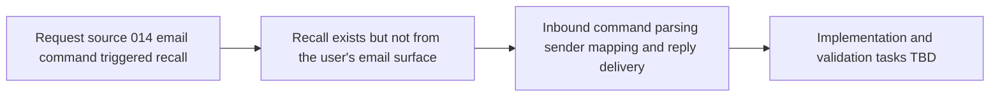

## item_014_day_captain_email_command_triggered_recall - Add recall triggered by inbound email commands
> From version: 0.9.0
> Status: Done
> Understanding: 99%
> Confidence: 99%
> Progress: 100%
> Complexity: Medium
> Theme: Product
> Reminder: Update status/understanding/confidence/progress and linked task references when you edit this doc.

# Problem
- Day Captain already supports recall by CLI and hosted HTTP trigger, but not from the user’s natural working surface: email itself.
- A dedicated `daycaptain` mailbox now exists, so it can act not only as a sender identity but also as a command inbox.
- Without an inbound email command path, users still need an operator-oriented trigger or a manual tool to ask for a recall, which breaks the intended assistant experience.

# Scope
- In:
  - support recall triggered by sending a bounded command email to the dedicated Day Captain mailbox
  - support `recall` and `recall-today` as equivalent current-day commands
  - support `recall-week` as a start-of-week-through-now command
  - map the inbound sender to an allowed target user safely
  - reply by email with the requested digest
  - suppress duplicate processing of the same inbound command message
  - document the supported command vocabulary and the chosen inbound-trigger model
- Out:
  - free-form natural-language email conversations
  - attachment-driven workflows
  - public self-service onboarding
  - a generic email automation engine beyond bounded Day Captain recall commands

# Acceptance criteria
- AC1: A supported inbound email command can trigger recall without CLI or manual ops tooling.
- AC2: `recall` and `recall-today` generate the current-day digest.
- AC3: `recall-week` generates a digest from the start of the current week through the current time.
- AC4: Week boundaries use the configured display timezone, with Monday as the default week start.
- AC5: Sender validation prevents one user from triggering another user’s recall accidentally.
- AC6: The recall response is delivered by email through the Day Captain delivery path.
- AC7: Duplicate inbound command messages do not produce multiple replies.
- AC8: Automated tests cover command parsing, sender mapping, week-window resolution, and duplicate suppression.
- AC9: Docs explain the supported commands, mailbox setup, and chosen trigger mechanism.
- AC10: The design remains compatible with tenant-scoped multi-user hosted execution and a dedicated sender mailbox.

# AC Traceability
- AC1 -> Scope includes inbound email command triggering. Proof: item explicitly replaces operator-only recall triggers with a mailbox-driven command path.
- AC2 -> Scope includes current-day commands. Proof: item explicitly supports `recall` and `recall-today` as equivalent current-day commands.
- AC3 -> Scope includes week recall. Proof: item explicitly supports `recall-week` from the start of the current week through now.
- AC4 -> Scope includes timezone semantics. Proof: item explicitly binds week-window behavior to the configured display timezone with Monday as default week start.
- AC5 -> Scope includes sender mapping. Proof: item explicitly requires safe sender-to-target-user validation.
- AC6 -> Scope includes reply delivery. Proof: item explicitly requires the result to be returned by email.
- AC7 -> Scope includes duplicate suppression. Proof: item explicitly requires the same inbound command not to trigger multiple replies.
- AC8 -> Scope includes automated coverage. Proof: item explicitly requires tests for parsing, mapping, week windows, and deduplication.
- AC9 -> Scope includes documentation. Proof: item explicitly requires operator docs for commands and trigger setup.
- AC10 -> Scope preserves current hosted direction. Proof: item explicitly keeps compatibility with tenant-scoped multi-user execution and a dedicated sender mailbox.

# Links
- Request: `req_014_day_captain_email_command_triggered_recall`
- Primary task(s): `task_022_day_captain_recall_and_delivery_evolution_orchestration` (`Done`)

# Priority
- Impact: Medium - the product works without it, but this is a meaningful usability upgrade for recall.
- Urgency: Medium - the dedicated mailbox now exists, which makes the feature timely and concrete.

# Notes
- Derived from request `req_014_day_captain_email_command_triggered_recall`.
- This slice should stay bounded: explicit commands first, not an open-ended conversational mail assistant.
- The first shipped version can still choose between webhook, polling, or an external inbound trigger bridge as long as the user-facing contract remains stable.
- Closed on Sunday, March 8, 2026 through `task_022_day_captain_recall_and_delivery_evolution_orchestration`, with hosted `email-command-recall` validation passing for `recall-week` on `https://day-captain.onrender.com`.
