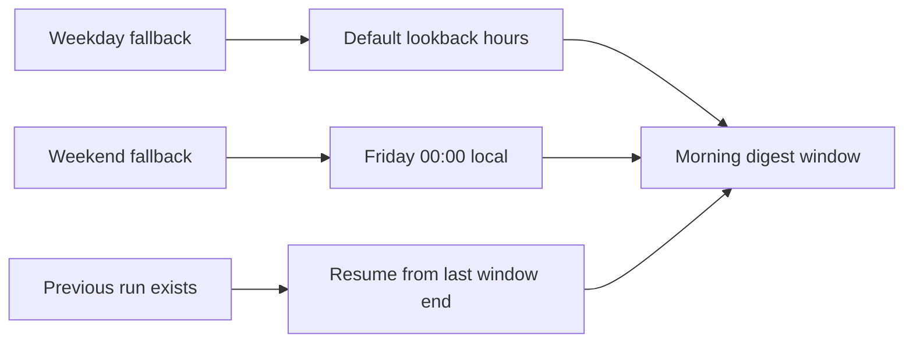

## item_015_day_captain_weekend_digest_window_from_friday - Extend the first weekend digest mail window back to Friday
> From version: 0.10.0
> Status: Ready
> Understanding: 99%
> Confidence: 99%
> Progress: 0%
> Complexity: Medium
> Theme: Product
> Reminder: Update status/understanding/confidence/progress and linked task references when you edit this doc.

# Problem
- The current default fallback window for `morning-digest` is a simple rolling lookback, which makes the first Saturday or Sunday digest too narrow for weekend usage.
- A user opening the digest for the first time over the weekend usually expects a recap that includes Friday mail, not only the last 24 hours.
- Weekend meetings already use a distinct product rule by shifting to Monday, so the mail horizon should be made equally intentional instead of remaining a weekday-shaped default.

# Scope
- In:
  - change the fallback mail window for first-run weekend `morning-digest` execution so Saturday and Sunday start from Friday `00:00` in `DAY_CAPTAIN_DISPLAY_TIMEZONE`
  - preserve existing weekday fallback behavior based on `DAY_CAPTAIN_DEFAULT_LOOKBACK_HOURS`
  - preserve non-overlap behavior when a previous run already exists for the scoped user
  - add regression coverage for Saturday, Sunday, weekday control, and repeated weekend runs
  - document the weekend recap behavior so operators and users understand the product rule
- Out:
  - changing `recall-week`
  - changing weekday digest semantics
  - changing scoring, wording, rendering, or delivery
  - changing the existing Saturday/Sunday Monday-meeting preview behavior

# Acceptance criteria
- AC1: On Saturday, when no previous run exists for the scoped user, `morning-digest` starts the mail window at Friday `00:00` in `DAY_CAPTAIN_DISPLAY_TIMEZONE`.
- AC2: On Sunday, when no previous run exists for the scoped user, `morning-digest` starts the mail window at Friday `00:00` in `DAY_CAPTAIN_DISPLAY_TIMEZONE`.
- AC3: Weekday fallback behavior remains unchanged when no previous run exists.
- AC4: If a previous run exists, Day Captain resumes from `previous_run.window_end + 1 microsecond` instead of reopening the full Friday-to-weekend range.
- AC5: Weekend meeting behavior remains unchanged and still previews Monday meetings.
- AC6: Automated tests cover Saturday first-run, Sunday first-run, weekday control, and repeated weekend-run continuity.
- AC7: Docs explain the intentional Friday-to-weekend weekend digest horizon.

# AC Traceability
- AC1 -> Scope includes Saturday weekend fallback behavior. Proof: item explicitly starts Saturday first-run windows at Friday local midnight.
- AC2 -> Scope includes Sunday weekend fallback behavior. Proof: item explicitly starts Sunday first-run windows at Friday local midnight.
- AC3 -> Scope preserves weekday behavior. Proof: item explicitly keeps weekday fallback on `DAY_CAPTAIN_DEFAULT_LOOKBACK_HOURS`.
- AC4 -> Scope preserves continuity. Proof: item explicitly keeps the previous-run resume path for repeated weekend runs.
- AC5 -> Scope excludes meeting behavior changes. Proof: item explicitly preserves the current Monday-preview weekend rule.
- AC6 -> Scope includes regression tests. Proof: item explicitly requires coverage for weekend and weekday control cases plus repeated runs.
- AC7 -> Scope includes documentation. Proof: item explicitly requires operator/user explanation of the weekend mail horizon.

# Links
- Request: `req_015_day_captain_weekend_digest_window_from_friday`
- Primary task(s): `task_023_day_captain_weekend_window_and_reliability_orchestration` (`Ready`)

# Priority
- Impact: Medium - weekend digests remain usable today, but the current horizon underserves the intended Friday-to-weekend recap use case.
- Urgency: Medium - this is a product expectation gap that is easiest to fix while weekend behavior is actively being shaped.

# Notes
- Derived from request `req_015_day_captain_weekend_digest_window_from_friday`.
- This slice should stay product-bounded: first weekend run gets a broader mail horizon, repeated weekend runs stay incremental.
