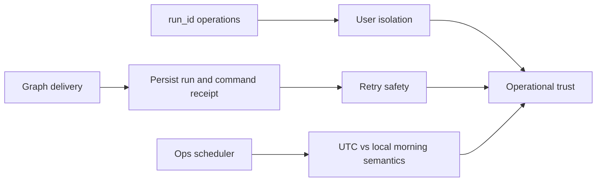

## item_016_day_captain_isolation_and_delivery_reliability_hardening - Harden run isolation, retry safety, and scheduler time semantics
> From version: 0.10.0
> Status: Ready
> Understanding: 99%
> Confidence: 99%
> Progress: 0%
> Complexity: High
> Theme: Reliability
> Reminder: Update status/understanding/confidence/progress and linked task references when you edit this doc.

# Problem
- The latest project review uncovered remaining reliability gaps in areas that should now be operationally safe: cross-user `run_id` access, retry behavior around delivery and persistence, and production scheduler semantics.
- These issues are subtle because the main happy-path suite is green and some hosted surfaces already guard a subset of the risky paths, but the application-level contracts are still too permissive.
- Leaving these gaps open risks cross-user data exposure, duplicate digests after partial failures, and ongoing operational confusion about when the production scheduler really runs.

# Scope
- In:
  - harden `recall_digest(run_id=...)` so it cannot cross user boundaries when `target_user_id` is omitted
  - harden `record_feedback(run_id=...)` with the same isolation guarantees
  - make send/persist ordering or dedupe behavior safe under partial failures after Microsoft Graph delivery succeeded
  - make `email-command-recall` replay-safe if delivery succeeded but persistence of the inbound command receipt failed
  - define and document the intended production scheduler time semantics, including DST behavior
  - add automated regression coverage for the reviewed reliability defects
- Out:
  - redesigning digest wording, scoring, or rendering
  - changing the supported recall command vocabulary
  - changing weekend digest scope semantics
  - introducing a new inbound trigger transport such as Graph webhooks

# Acceptance criteria
- AC1: `recall_digest(run_id=...)` cannot return another user’s digest when `target_user_id` is omitted in a multi-user setup.
- AC2: `record_feedback(run_id=...)` cannot mutate another user’s feedback state when `target_user_id` is omitted in a multi-user setup.
- AC3: If delivery succeeds but run persistence fails immediately afterward, retrying the same operation does not silently send duplicate digests without a durable reconciliation path.
- AC4: If `email-command-recall` delivery succeeds but persistence of the command receipt fails immediately afterward, replaying the same inbound message does not produce duplicate replies.
- AC5: Production scheduler time semantics are explicit and documented, including the chosen DST behavior.
- AC6: Automated tests cover cross-user `run_id` recall, cross-user `run_id` feedback, delivery/persistence partial failures, email-command replay after partial persistence failure, and the chosen scheduler time invariant.
- AC7: Hosted/operator docs are updated so the shipped behavior is explicit for operators rather than hidden only in code and tests.

# AC Traceability
- AC1 -> Scope includes recall isolation hardening. Proof: item explicitly prevents cross-user `run_id` recall when caller scope is omitted.
- AC2 -> Scope includes feedback isolation hardening. Proof: item explicitly prevents cross-user `run_id` feedback mutation when caller scope is omitted.
- AC3 -> Scope includes send/persist reliability. Proof: item explicitly hardens behavior after Graph delivery succeeds but persistence fails.
- AC4 -> Scope includes inbound dedupe reliability. Proof: item explicitly hardens replay safety for partial email-command persistence failure.
- AC5 -> Scope includes scheduler semantics. Proof: item explicitly requires a documented and testable statement of production time behavior.
- AC6 -> Scope includes regression coverage. Proof: item explicitly requires tests for the reviewed isolation and partial-failure paths.
- AC7 -> Scope includes documentation. Proof: item explicitly requires hosted/operator docs to expose the chosen behavior.

# Links
- Request: `req_016_day_captain_isolation_and_delivery_reliability_hardening`
- Primary task(s): `task_023_day_captain_weekend_window_and_reliability_orchestration` (`Ready`)

# Priority
- Impact: High - the open gaps touch isolation, idempotency, and operator trust in production scheduling.
- Urgency: High - the defects have already been reproduced or clearly identified in code review.

# Notes
- Derived from request `req_016_day_captain_isolation_and_delivery_reliability_hardening`.
- This slice is corrective reliability work, not roadmap expansion.
- The most sensitive risks are cross-user `run_id` access and duplicate sends after partial persistence failure.
