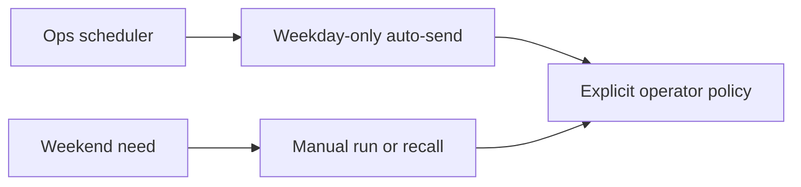

## item_017_day_captain_ops_scheduler_weekday_only_delivery - Freeze ops auto-send to weekdays only
> From version: 0.10.0
> Status: Ready
> Understanding: 99%
> Confidence: 99%
> Progress: 0%
> Complexity: Low
> Theme: Operations
> Reminder: Update status/understanding/confidence/progress and linked task references when you edit this doc.

# Problem
- Weekend digest behavior is evolving, but production auto-send policy must remain clearly weekday-only.
- Without an explicit slice, future edits could broaden weekend content behavior and accidentally imply or re-enable Saturday/Sunday scheduled sends.
- Operators need a documented distinction between automatic weekday delivery and weekend manual access paths.

# Scope
- In:
  - make weekday-only production auto-send an explicit ops contract
  - verify the `day-captain-ops` scheduler expresses Monday-to-Friday behavior only
  - document that weekend digests remain manual or recall-driven rather than automatically scheduled
  - add operator verification guidance for confirming weekday-only scheduling
- Out:
  - changing the weekend digest mail horizon
  - changing recall or email-command behavior
  - changing weekday delivery times
  - redesigning hosted job execution

# Acceptance criteria
- AC1: The ops scheduler does not automatically send `morning-digest` on Saturday or Sunday.
- AC2: Weekend digest generation remains available manually or through recall flows.
- AC3: Operator docs clearly separate weekday auto-send policy from weekend manual access.
- AC4: Verification steps exist so operators can confirm the weekday-only policy quickly.

# AC Traceability
- AC1 -> Scope includes weekday-only scheduling. Proof: item explicitly freezes automatic sends to weekdays.
- AC2 -> Scope preserves weekend manual access. Proof: item explicitly keeps weekend access through manual or recall flows.
- AC3 -> Scope includes documentation. Proof: item explicitly requires operator docs to separate auto-send from weekend access.
- AC4 -> Scope includes validation guidance. Proof: item explicitly requires a quick verification path for operators.

# Links
- Request: `req_017_day_captain_ops_scheduler_weekday_only_delivery`
- Primary task(s): `task_023_day_captain_weekend_window_and_reliability_orchestration` (`Ready`)

# Priority
- Impact: Medium - accidental weekend auto-sends would be noisy and user-visible, but the current intent is easy to preserve if it is frozen explicitly now.
- Urgency: Medium - this is best clarified now while weekend digest behavior is being refined.

# Notes
- Derived from request `req_017_day_captain_ops_scheduler_weekday_only_delivery`.
- This slice is intentionally operational rather than architectural.
