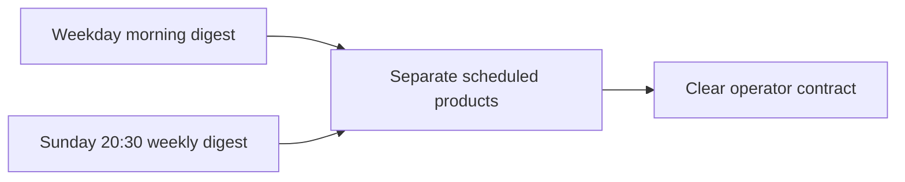

## item_018_day_captain_sunday_evening_weekly_digest - Add a Sunday-evening weekly digest schedule
> From version: 0.10.0
> Status: Done
> Understanding: 99%
> Confidence: 99%
> Progress: 100%
> Complexity: Medium
> Theme: Product
> Reminder: Update status/understanding/confidence/progress and linked task references when you edit this doc.

# Problem
- Freezing weekend `morning-digest` auto-send to weekdays only is correct, but it leaves no scheduled weekend recap surface.
- The product now needs a deliberate Sunday-evening cadence for a weekly digest rather than relying only on manual recall.
- Without an explicit slice, the Sunday weekly use case can get conflated with weekend morning delivery or with ad hoc recall.

# Scope
- In:
  - add an explicit scheduled `weekly digest` path for Sunday at `20:30`
  - keep weekday `morning-digest` and Sunday `weekly digest` as separate scheduler contracts
  - document the operator-facing distinction between weekday morning delivery and Sunday-evening weekly recap
  - add verification guidance for the Sunday weekly scheduler path
- Out:
  - changing weekday `morning-digest` behavior
  - changing recall commands
  - changing weekend first-run Friday lookback rules
  - redesigning delivery transport

# Acceptance criteria
- AC1: A `weekly digest` scheduler contract exists for Sunday at `20:30`.
- AC2: The Sunday weekly schedule is explicitly distinct from weekday `morning-digest` auto-send.
- AC3: Operator docs explain both contracts without ambiguity.
- AC4: Verification steps exist so operators can confirm the Sunday weekly schedule separately from weekday morning scheduling.

# AC Traceability
- AC1 -> Scope includes Sunday weekly scheduling. Proof: item explicitly adds a Sunday `20:30` scheduled weekly digest path.
- AC2 -> Scope separates contracts. Proof: item explicitly keeps weekday morning and Sunday weekly scheduling distinct.
- AC3 -> Scope includes docs. Proof: item explicitly requires operator-facing explanation of the two scheduled products.
- AC4 -> Scope includes validation guidance. Proof: item explicitly requires separate verification of the Sunday weekly schedule.

# Links
- Request: `req_018_day_captain_sunday_evening_weekly_digest`
- Primary task(s): `task_023_day_captain_weekend_window_and_reliability_orchestration` (`Done`)

# Priority
- Impact: Medium - this adds a useful recurring recap surface without disturbing weekday delivery.
- Urgency: Medium - best defined now while weekend scheduling rules are being made explicit.

# Notes
- Derived from request `req_018_day_captain_sunday_evening_weekly_digest`.
- This slice should stay clear that Sunday weekly scheduling does not reopen Saturday/Sunday `morning-digest` auto-send.
- Closed by `task_023_day_captain_weekend_window_and_reliability_orchestration` after adding the Sunday weekly digest flow, scheduler templates, ops workflow, and docs.
