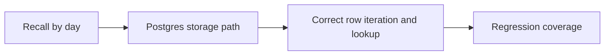

## item_019_day_captain_postgres_day_recall_fix - Fix hosted Postgres day-based recall loading
> From version: 0.11.0
> Status: Done
> Understanding: 99%
> Confidence: 99%
> Progress: 100%
> Complexity: Medium
> Theme: Reliability
> Reminder: Update status/understanding/confidence/progress and linked task references when you edit this doc.

# Problem
- The hosted Postgres path for `recall-digest --day ...` contains a broken local variable path in `get_latest_completed_run_for_day()`.
- That makes day-based recall vulnerable to runtime failure in production even though the happy-path test suite is green.
- The issue is backend-specific, so it is easy to miss until hosted recall is actually used on Postgres.

# Scope
- In:
  - fix the Postgres implementation of `get_latest_completed_run_for_day()`
  - add regression coverage that exercises day-based recall on the Postgres-backed storage path
  - confirm hosted recall-by-day behavior matches the intended product timezone semantics already defined
- Out:
  - changing run scoping semantics
  - changing day-to-timezone behavior
  - redesigning recall UX or delivery

# Acceptance criteria
- AC1: The Postgres-backed implementation of `get_latest_completed_run_for_day()` no longer crashes because of a broken local variable reference.
- AC2: `recall-digest` by day works correctly when the application is backed by Postgres.
- AC3: Regression tests cover the Postgres day-recall path explicitly.

# AC Traceability
- AC1 -> Scope includes Postgres fix. Proof: item explicitly fixes the broken local variable path in day-based recall loading.
- AC2 -> Scope includes hosted recall behavior. Proof: item explicitly validates day-based recall on Postgres-backed runtime behavior.
- AC3 -> Scope includes regression coverage. Proof: item explicitly requires tests for the Postgres path.

# Links
- Request: `req_019_day_captain_post_review_reliability_and_scheduler_recovery`
- Primary task(s): `task_024_day_captain_post_review_reliability_orchestration` (`Done`)

# Priority
- Impact: High - hosted recall-by-day can fail in the production backend.
- Urgency: High - this is a deterministic runtime defect, not a theoretical risk.

# Notes
- Derived from request `req_019_day_captain_post_review_reliability_and_scheduler_recovery`.
