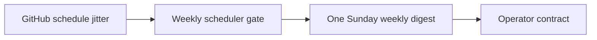

## item_020_day_captain_weekly_scheduler_jitter_tolerance - Make Sunday weekly scheduling tolerant to GitHub cron jitter
> From version: 0.11.0
> Status: Ready
> Understanding: 99%
> Confidence: 99%
> Progress: 0%
> Complexity: Medium
> Theme: Operations
> Reminder: Update status/understanding/confidence/progress and linked task references when you edit this doc.

# Problem
- The Sunday `weekly-digest` scheduler currently relies on an exact local `20:30` match.
- GitHub Actions `schedule` runs are not guaranteed to start at the exact minute, so small delays can skip the entire weekly digest run.
- That makes the weekly scheduler operationally fragile even if the code path itself is correct.

# Scope
- In:
  - harden the weekly scheduler gate so normal GitHub cron jitter still yields one intended Sunday-evening run
  - keep the product contract at Sunday `20:30 Europe/Paris`
  - preserve the distinction between weekday-only `morning-digest` auto-send and Sunday `weekly-digest`
  - add validation or tests for the chosen gate behavior
  - update operator docs if the gate semantics change
- Out:
  - changing the weekly digest local time
  - enabling weekend `morning-digest` auto-send
  - replacing GitHub Actions as the scheduler

# Acceptance criteria
- AC1: Normal GitHub Actions scheduling jitter does not cause the Sunday weekly digest to be skipped entirely.
- AC2: The effective operator contract remains a Sunday `20:30 Europe/Paris` weekly digest.
- AC3: Validation guidance or automated checks cover the chosen gate behavior.
- AC4: Operator docs explain the scheduler gate behavior clearly enough to debug future misses.
- AC6: Automated checks or tests cover the chosen delayed-schedule gate behavior so the Sunday scheduler is not validated only manually.
- AC7: README or operator docs explain the final Sunday scheduler gate behavior before the slice is closed.

# AC Traceability
- AC1 -> Scope includes jitter tolerance. Proof: item explicitly hardens the gate against non-exact schedule starts.
- AC2 -> Scope preserves product time. Proof: item explicitly keeps the Sunday `20:30 Europe/Paris` contract.
- AC3 -> Scope includes validation. Proof: item explicitly requires checks for the chosen gate semantics.
- AC4 -> Scope includes docs. Proof: item explicitly requires operator-facing explanation of the gate behavior.
- AC6 -> Scope includes validation. Proof: item explicitly requires delayed-schedule automated checks or tests.
- AC7 -> Scope includes docs. Proof: item explicitly requires README or operator explanation before closure.

# Links
- Request: `req_019_day_captain_post_review_reliability_and_scheduler_recovery`
- Primary task(s): `task_024_day_captain_post_review_reliability_orchestration` (`Ready`)

# Priority
- Impact: High - a skipped weekly digest is a user-visible failure of the new Sunday scheduling feature.
- Urgency: High - the risk exists immediately in production scheduling.

# Notes
- Derived from request `req_019_day_captain_post_review_reliability_and_scheduler_recovery`.
