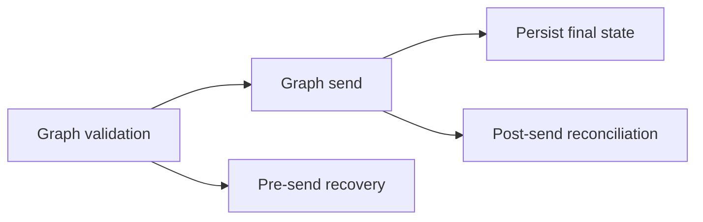

## item_021_day_captain_pre_send_delivery_state_recovery - Refine digest run states so pre-send failures remain recoverable
> From version: 0.11.0
> Status: Done
> Understanding: 99%
> Confidence: 99%
> Progress: 100%
> Complexity: High
> Theme: Reliability
> Reminder: Update status/understanding/confidence/progress and linked task references when you edit this doc.

# Problem
- The current reliability hardening writes `delivery_pending` before Graph validation/send.
- That protects against uncertain post-send persistence, but it also blocks future runs when delivery never actually started.
- Operators need a recovery model that distinguishes pre-send failure from post-send uncertainty instead of treating both the same way.

# Scope
- In:
  - refine digest run state handling around Graph validation and delivery
  - keep duplicate-send protection for post-send uncertainty
  - avoid indefinite blocking after failures that occurred before delivery acceptance
  - add regression tests for pre-send failure behavior
  - update operator docs if reconciliation or recovery behavior changes
- Out:
  - redesigning the digest payload
  - changing Graph delivery transport
  - changing user-facing digest content

# Acceptance criteria
- AC1: Failures before delivery acceptance do not leave the latest run in a permanently blocking `delivery_pending` state.
- AC2: Failures after delivery may already have been accepted still preserve an explicit reconciliation path.
- AC3: Later valid digest runs are not blocked forever by stale pre-send pending markers.
- AC4: Regression tests cover pre-send failure and post-send uncertainty separately.
- AC5: If delivery may already have been accepted but persistence remains uncertain, the system still preserves an explicit reconciliation path rather than silently duplicating sends.
- AC6: Automated tests cover the refined digest run-state behavior for both pre-send failures and post-send uncertainty.
- AC7: Operator docs explain the final recovery semantics if manual reconciliation is still required.

# AC Traceability
- AC1 -> Scope includes pre-send recovery. Proof: item explicitly separates pre-send failure handling from post-send uncertainty.
- AC2 -> Scope preserves reconciliation. Proof: item explicitly keeps a durable path for uncertain post-send outcomes.
- AC3 -> Scope includes unblock semantics. Proof: item explicitly avoids indefinite blocking from stale pending runs.
- AC4 -> Scope includes regression coverage. Proof: item explicitly requires tests for both failure classes.
- AC5 -> Scope preserves reconciliation. Proof: item explicitly keeps reconciliation when delivery may already have happened.
- AC6 -> Scope includes regression coverage. Proof: item explicitly requires automated tests for both pre-send and post-send run-state outcomes.
- AC7 -> Scope includes docs. Proof: item explicitly requires operator-facing recovery documentation.

# Links
- Request: `req_019_day_captain_post_review_reliability_and_scheduler_recovery`
- Primary task(s): `task_024_day_captain_post_review_reliability_orchestration` (`Done`)

# Priority
- Impact: High - stale pending states can stop delivery entirely for a user.
- Urgency: High - this affects the reliability model introduced in the last hardening slice.

# Notes
- Derived from request `req_019_day_captain_post_review_reliability_and_scheduler_recovery`.
