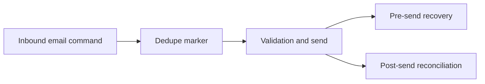

## item_022_day_captain_email_command_pre_send_recovery - Refine email-command dedupe so pre-send failures do not become unrecoverable
> From version: 0.11.0
> Status: Done
> Understanding: 99%
> Confidence: 99%
> Progress: 100%
> Complexity: High
> Theme: Reliability
> Reminder: Update status/understanding/confidence/progress and linked task references when you edit this doc.

# Problem
- `email-command-recall` currently persists its command receipt before Graph validation/send.
- That protects against duplicate replies after uncertain delivery, but it also turns pre-send failures into a stale dedupe barrier that blocks later safe retries for the same inbound command.
- The product needs replay-safe behavior without trapping a failed command in an unrecoverable "pending" state when no reply was actually sent.

# Scope
- In:
  - refine email-command dedupe persistence/recovery semantics
  - preserve duplicate-reply protection when delivery may already have happened
  - allow safe recovery when failure happened before delivery acceptance
  - add regression tests for pre-send email-command failure behavior
  - update docs if reconciliation guidance changes
- Out:
  - changing the supported command vocabulary
  - changing sender allowlist semantics
  - adding a new inbound transport

# Acceptance criteria
- AC1: If `email-command-recall` fails before delivery acceptance, replaying the same inbound command can recover safely.
- AC2: If delivery may already have been accepted, replaying the same inbound command still avoids duplicate replies and preserves a reconciliation path.
- AC3: Pre-send and post-send email-command failure modes are covered by regression tests.
- AC4: Operator docs explain the resulting recovery behavior if manual intervention is still required in some cases.
- AC6: Automated tests cover the pre-send and post-send `email-command-recall` failure classes explicitly.
- AC7: Operator docs explain the final replay and reconciliation behavior before the slice is closed.

# AC Traceability
- AC1 -> Scope includes pre-send recovery. Proof: item explicitly allows safe replay when no reply was accepted yet.
- AC2 -> Scope preserves duplicate protection. Proof: item explicitly keeps reconciliation for uncertain post-send outcomes.
- AC3 -> Scope includes regression tests. Proof: item explicitly requires tests for both failure classes.
- AC4 -> Scope includes docs. Proof: item explicitly requires operator-facing explanation of recovery semantics.
- AC6 -> Scope includes regression tests. Proof: item explicitly requires explicit automated coverage for both `email-command-recall` failure classes.
- AC7 -> Scope includes docs. Proof: item explicitly requires final operator-facing replay and reconciliation documentation.

# Links
- Request: `req_019_day_captain_post_review_reliability_and_scheduler_recovery`
- Primary task(s): `task_024_day_captain_post_review_reliability_orchestration` (`Done`)

# Priority
- Impact: High - a stale dedupe barrier can make email-command recall appear broken to the user.
- Urgency: High - this affects the new inbound recall product path directly.

# Notes
- Derived from request `req_019_day_captain_post_review_reliability_and_scheduler_recovery`.
