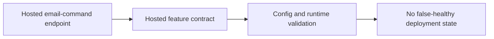

## item_024_day_captain_hosted_email_command_contract_enforcement - Enforce hosted email-command recall prerequisites
> From version: 0.12.0
> Status: Ready
> Understanding: 100%
> Confidence: 100%
> Progress: 0%
> Complexity: High
> Theme: Reliability
> Reminder: Update status/understanding/confidence/progress and linked task references when you edit this doc.

# Problem
- The hosted `email-command-recall` endpoint is exposed and documented as a supported surface.
- It always executes through `graph_send`, but hosted validation only enforces `graph_send` prerequisites when the global deployment delivery mode is already `graph_send`.
- That lets a hosted service report healthy while the inbound email-command feature is guaranteed to fail at runtime.

# Scope
- In:
  - define the hosted feature contract for `email-command-recall`
  - enforce the required `graph_send` prerequisites for hosted deployments that expose that feature
  - keep runtime validation and operator expectations aligned
  - add automated coverage for the hosted feature contract
  - update README and operator docs if the hosted feature contract changes
- Out:
  - changing command vocabulary
  - changing sender allowlist semantics
  - redesigning the inbound bridge transport

# Acceptance criteria
- AC1: A hosted deployment cannot advertise a healthy `email-command-recall` surface while missing the required `graph_send` prerequisites for that feature.
- AC2: Automated tests cover the hosted validation and runtime contract for `email-command-recall`.
- AC3: Operator-facing docs explain the required hosted prerequisites for `email-command-recall`.
- AC4: README and operator docs explain the final hosted `email-command-recall` prerequisites before the slice is closed.

# AC Traceability
- AC1 -> Scope includes hosted contract enforcement. Proof: item explicitly blocks false-healthy hosted states for `email-command-recall`.
- AC2 -> Scope includes automated coverage. Proof: item explicitly requires tests for the hosted feature contract.
- AC3 -> Scope includes operator docs. Proof: item explicitly requires hosted prerequisite documentation.
- AC4 -> Scope includes docs. Proof: item explicitly requires README and operator updates when the hosted contract changes.

# Links
- Request: `req_020_day_captain_scheduler_template_and_hosted_email_command_contract_hardening`
- Primary task(s): `task_025_day_captain_scheduler_template_and_hosted_contract_orchestration` (`Ready`)

# Priority
- Impact: High - operators can deploy a hosted service that looks valid while a documented feature is broken.
- Urgency: High - the mismatch exists at deployment time, not only under edge conditions.

# Notes
- Derived from request `req_020_day_captain_scheduler_template_and_hosted_email_command_contract_hardening`.
