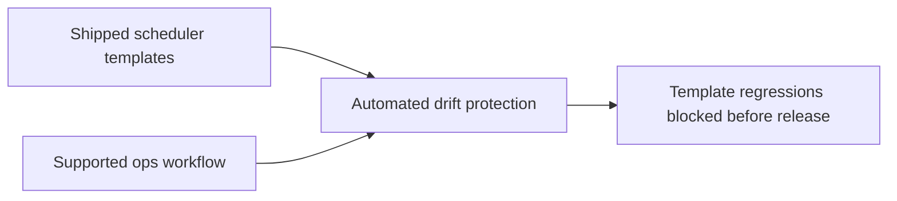

## item_025_day_captain_scheduler_template_drift_protection - Add automated protection against scheduler template drift
> From version: 0.12.0
> Status: Ready
> Understanding: 100%
> Confidence: 100%
> Progress: 0%
> Complexity: Medium
> Theme: Quality
> Reminder: Update status/understanding/confidence/progress and linked task references when you edit this doc.

# Problem
- The app repo CI validates Python code and Logics documents, but it does not protect the scheduler templates against drift from the supported production workflow.
- That gap is why the old exact-minute weekly gate remained in shipped templates while the real ops workflow had already been hardened.
- Without automated protection, future scheduler template regressions can ship unnoticed.

# Scope
- In:
  - add automated validation that protects the weekly scheduler templates from drifting away from the supported behavior
  - choose a check that is maintainable and understandable for operators and contributors
  - keep the protected contract aligned with the supported `day-captain-ops` workflow
  - document the validation expectation in README or operator docs if needed
- Out:
  - adding a broad YAML linting framework unrelated to this reliability gap
  - replacing existing unit or Logics checks
  - changing the scheduling platform

# Acceptance criteria
- AC1: Automated validation detects future drift between the weekly scheduler templates and the supported production workflow semantics.
- AC2: The chosen protection is exercised in the routine validation path before release.
- AC3: The resulting validation expectation is documented where operators or contributors need it.

# AC Traceability
- AC1 -> Scope includes automated drift protection. Proof: item explicitly requires detection of weekly template drift.
- AC2 -> Scope includes routine validation. Proof: item explicitly requires the protection to run before release.
- AC3 -> Scope includes docs. Proof: item explicitly requires the validation expectation to be documented if needed.

# Links
- Request: `req_020_day_captain_scheduler_template_and_hosted_email_command_contract_hardening`
- Primary task(s): `task_025_day_captain_scheduler_template_and_hosted_contract_orchestration` (`Ready`)

# Priority
- Impact: Medium - drift is preventable but otherwise easy to reintroduce silently.
- Urgency: Medium - the gap is already proven by the last scheduler regression.

# Notes
- Derived from request `req_020_day_captain_scheduler_template_and_hosted_email_command_contract_hardening`.
