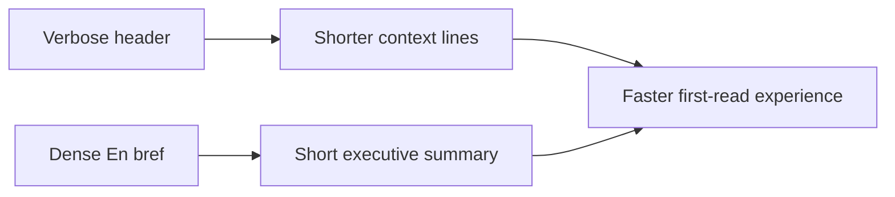

## item_026_day_captain_digest_header_and_executive_summary_polish - Polish digest header and executive summary readability
> From version: 1.0.0
> Status: Ready
> Understanding: 99%
> Confidence: 98%
> Progress: 0%
> Complexity: Medium
> Theme: UX
> Reminder: Update status/understanding/confidence/progress and linked task references when you edit this doc.

# Problem
- The top of the digest still reads too much like a generated report.
- The header repeats timing context and the `En bref` block remains too dense for a real executive summary.
- That slows down the first-read experience even when the actual content is relevant.

# Scope
- In:
  - shorten and simplify the digest header/context lines
  - redefine `En bref` as a genuinely short executive summary
  - tune prompt or rendering structure so the top block stays concise and non-redundant
  - preserve essential date/window context without verbose report wording
- Out:
  - redesigning lower sections in depth
  - changing meeting rendering beyond what is needed to avoid summary repetition
  - changing transport or delivery behavior

# Acceptance criteria
- AC1: The digest header/context is shorter and avoids redundant report phrasing.
- AC2: `En bref` is concise enough to be understood in a few seconds.
- AC3: The top summary does not verbosely restate downstream sections.

# AC Traceability
- AC1 -> Scope includes header simplification. Proof: item explicitly shortens and simplifies the digest header/context.
- AC2 -> Scope includes executive summary polish. Proof: item explicitly redefines `En bref` as a short executive summary.
- AC3 -> Scope includes prompt/render tuning. Proof: item explicitly prevents redundant top-summary repetition.

# Links
- Request: `req_021_day_captain_digest_email_readability_and_scannability_polish`
- Primary task(s): `task_026_day_captain_digest_readability_and_scannability_orchestration` (`Ready`)

# Priority
- Impact: High - the first screen of the digest defines whether the mail feels actionable or report-like.
- Urgency: Medium - the feature works, but readability is still below product quality expectations.

# Notes
- Derived from direct Outlook review feedback on the live digest rendering.
