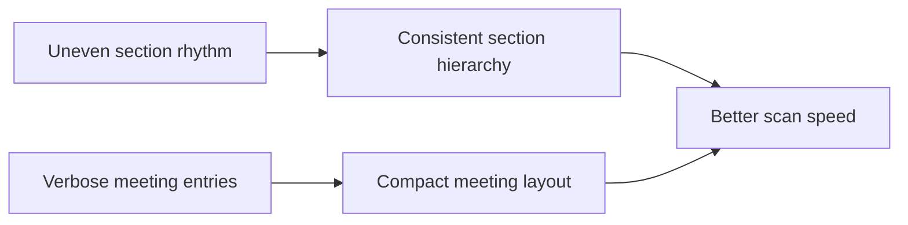

## item_027_day_captain_digest_section_and_meeting_scannability_polish - Polish digest section rhythm and meeting scannability
> From version: 1.0.0
> Status: In Progress
> Understanding: 99%
> Confidence: 98%
> Progress: 80%
> Complexity: Medium
> Theme: UX
> Reminder: Update status/understanding/confidence/progress and linked task references when you edit this doc.

# Problem
- The digest sections are still unevenly paced and meeting entries consume too much vertical space.
- The mail is readable, but scanning priorities, watch items, and upcoming meetings is slower than it should be.
- Meeting lines need to emphasize time, title, and the most useful context without wasting vertical space.

# Scope
- In:
  - improve section hierarchy and spacing consistency
  - make digest items more scannable
  - compact meeting rendering while preserving time, title, and useful context
  - keep Outlook-compatible rendering constraints intact
- Out:
  - changing the underlying meeting-selection logic
  - changing the scoring model or content sourcing rules
  - redesigning the full HTML shell beyond local readability improvements

# Acceptance criteria
- AC1: Main digest sections have more consistent visual rhythm and are easier to scan in Outlook.
- AC2: Meeting entries are more compact and emphasize time, title, and the most useful context without wasting vertical space.
- AC3: The digest remains Outlook-compatible after the readability changes.

# AC Traceability
- Req021 AC3 -> Scope includes section hierarchy. Proof: item explicitly improves section hierarchy and spacing consistency.
- Req021 AC4 -> Scope includes compact meeting rendering. Proof: item explicitly compacts meetings while preserving key metadata.
- Req021 AC3/AC4 supporting constraint -> Scope preserves rendering constraints. Proof: item explicitly keeps Outlook-compatible rendering intact.

# Links
- Request: `req_021_day_captain_digest_email_readability_and_scannability_polish`
- Primary task(s): `task_026_day_captain_digest_readability_and_scannability_orchestration` (`In Progress`)

# Priority
- Impact: High - meeting-heavy digests become visually dense and reduce scan efficiency.
- Urgency: Medium - quality issue, not a transport or correctness issue.

# Notes
- Derived from direct Outlook rendering review after live use of the digest.
- Implementation is underway: section rendering is being tightened and meeting entries are now moving toward a more compact title-plus-context presentation.
