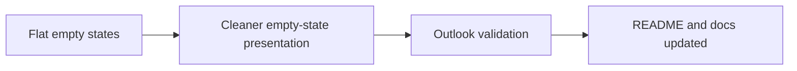

## item_028_day_captain_digest_empty_state_and_outlook_polish_validation - Polish digest empty states and validate final Outlook readability
> From version: 1.0.0
> Status: In Progress
> Understanding: 98%
> Confidence: 97%
> Progress: 55%
> Complexity: Medium
> Theme: UX
> Reminder: Update status/understanding/confidence/progress and linked task references when you edit this doc.

# Problem
- The digest empty states are functionally correct but visually flat, and the final readability quality still needs explicit Outlook validation.
- Empty states should remain explicit while becoming visually lighter and less report-like.
- Without a dedicated validation slice, readability changes can regress or remain only locally “better” without real Outlook confirmation.

# Scope
- In:
  - lighten empty-state copy and presentation
  - validate the final reading experience in Outlook after renderer changes
  - update README and any affected operator or product docs before closure
- Out:
  - creating a new transport or preview workflow
  - introducing a separate design system outside the existing digest renderer

# Acceptance criteria
- AC1: Empty states remain explicit but are visually lighter and less report-like.
- AC2: Final readability improvements are validated on a real Outlook rendering.
- AC3: README and any impacted operator or product docs are updated before the slice is closed.

# AC Traceability
- Req021 AC5 -> Scope includes empty-state polish. Proof: item explicitly lightens empty-state copy and presentation.
- Req021 AC5 supporting validation -> Scope includes Outlook validation. Proof: item explicitly requires final Outlook readability validation.
- Req021 AC6 -> Scope includes docs updates. Proof: item explicitly requires README and docs updates before closure.

# Links
- Request: `req_021_day_captain_digest_email_readability_and_scannability_polish`
- Primary task(s): `task_026_day_captain_digest_readability_and_scannability_orchestration` (`In Progress`)

# Priority
- Impact: Medium - empty states and validation quality shape the final perceived polish.
- Urgency: Medium - needed to close the slice cleanly.

# Notes
- Derived from operator feedback that the mail is useful but not yet as pleasant to read as it should be.
- Implementation is underway: empty-state copy/presentation is being lightened in the renderer, but the explicit real-Outlook validation step still remains before closure.
