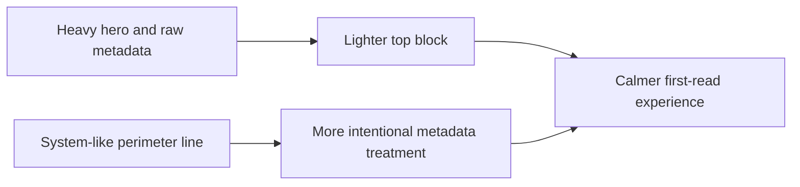

## item_029_day_captain_digest_hero_background_and_metadata_polish - Day Captain digest hero background and metadata polish
> From version: 1.1.0
> Status: In Progress
> Understanding: 97%
> Confidence: 95%
> Progress: 75%
> Complexity: Medium
> Theme: UX
> Reminder: Update status/understanding/confidence/progress and linked task references when you edit this doc.

# Problem
- The delivered digest still opens with a visually heavy hero area that dominates the first screen in Outlook.
- The gray background treatment and raw metadata styling make the top of the mail feel more like a system report than an intentional assistant brief.
- Even when the content is relevant, that first impression makes the digest feel denser than it needs to.

# Scope
- In:
  - reduce or remove the large heavy gray hero/background treatment if Outlook compatibility allows it
  - lighten the top header block so the first screen feels calmer
  - give the `Périmètre` / coverage line a more intentional visual treatment and less system-like copy
  - preserve the already-delivered date/window clarity from the previous readability pass
- Out:
  - redesigning lower section cards in depth
  - reopening the current `En bref` scope unless the top-area redesign requires a small adjustment
  - changing transport, recall, or delivery contracts

# Acceptance criteria
- AC1: The delivered digest no longer depends on a large heavy gray hero/background block; the top area feels materially lighter in Outlook.
- AC2: The coverage/perimeter line is visually styled and worded more intentionally than the current raw metadata treatment.
- AC3: The top of the digest preserves essential date/window information without regressing readability.

# AC Traceability
- Req022 AC1 -> Scope includes hero/background reduction. Proof: item explicitly lightens or removes the heavy hero treatment.
- Req022 AC3 -> Scope includes metadata/header polish. Proof: item explicitly restyles and rewrites the perimeter line.
- Req022 AC5 supporting constraint -> Scope preserves Outlook compatibility and readability gains. Proof: item explicitly preserves date/window clarity.

# Links
- Request: `req_022_day_captain_digest_visual_weight_and_header_polish`
- Primary task(s): `task_027_day_captain_digest_visual_weight_and_quick_actions_orchestration` (`In Progress`)

# Priority
- Impact: High - the top of the digest sets the tone for the whole mail and currently carries too much visual weight.
- Urgency: Medium - the feature works, but the current top-area treatment still looks heavier than intended in live Outlook.

# Notes
- Derived from direct review of the live Outlook rendering after the first readability pass.
- Implementation is underway: the hero/background treatment is being reduced and the perimeter line is moving toward a lighter, more intentional top-of-mail treatment.
