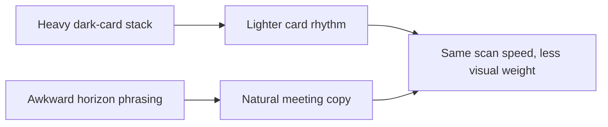

## item_030_day_captain_digest_card_weight_and_meeting_wording_polish - Day Captain digest card weight and meeting wording polish
> From version: 1.1.0
> Status: Ready
> Understanding: 96%
> Confidence: 94%
> Progress: 0%
> Complexity: Medium
> Theme: UX
> Reminder: Update status/understanding/confidence/progress and linked task references when you edit this doc.

# Problem
- The section cards are structurally clearer than before, but the current dark-card stack still feels visually heavy in Outlook.
- Borders, contrast, and vertical spacing make the digest feel denser than necessary even when the hierarchy is understandable.
- Some meeting wording still sounds awkward, especially when the real time horizon is Monday or tomorrow rather than a broader “next week”.

# Scope
- In:
  - lighten card contrast, borders, and spacing while preserving scan quality
  - keep section rhythm clear without relying on visually heavy dark blocks
  - tighten meeting-summary wording so time references feel natural in the delivered language
  - keep Outlook-compatible rendering constraints intact
- Out:
  - redesigning the top hero/metadata area in depth
  - changing which meetings are selected
  - changing scoring or source selection logic

# Acceptance criteria
- AC1: Section cards remain scannable but use lighter visual weight than the current dark-card stack.
- AC2: Meeting-summary wording uses more natural time-horizon phrasing in the delivered language.
- AC3: The digest remains Outlook-compatible after the visual-weight changes.

# AC Traceability
- Req022 AC2 -> Scope includes lighter card treatment. Proof: item explicitly reduces card visual weight while preserving scannability.
- Req022 AC4 -> Scope includes meeting wording polish. Proof: item explicitly improves horizon phrasing.
- Req022 AC5 -> Scope preserves compatibility. Proof: item explicitly keeps Outlook-compatible rendering constraints intact.

# Links
- Request: `req_022_day_captain_digest_visual_weight_and_header_polish`
- Primary task(s): `task_027_day_captain_digest_visual_weight_and_quick_actions_orchestration` (`Ready`)

# Priority
- Impact: High - most of the mail body still inherits a heavier visual treatment than necessary.
- Urgency: Medium - polish issue, not a product-correctness issue.

# Notes
- Derived from live Outlook review after the first card-based readability pass.
