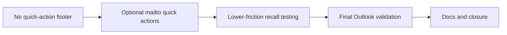

## item_031_day_captain_digest_quick_actions_and_final_outlook_validation - Day Captain digest quick actions and final Outlook validation
> From version: 1.1.0
> Status: In Progress
> Understanding: 96%
> Confidence: 94%
> Progress: 65%
> Complexity: Medium
> Theme: UX
> Reminder: Update status/understanding/confidence/progress and linked task references when you edit this doc.

# Problem
- The digest currently ends without an intentional quick-action area, even though the product already supports email-native recall commands.
- A small footer action strip could reduce friction for real usage and testing, but it must remain compatible with Outlook and the existing command contract.
- The final visual-polish slice also still needs explicit live Outlook validation before it can be treated as complete.

# Scope
- In:
  - evaluate and, if acceptable, add a small footer quick-action area with clickable `mailto:` links for supported commands
  - keep any quick-action links aligned with the existing `recall`, `recall-today`, and `recall-week` contract
  - perform final live Outlook validation on the polished rendering
  - update README and any impacted validation docs before closure if the footer contract changes
- Out:
  - changing the underlying command vocabulary
  - auto-sending commands without user confirmation
  - changing transport or delivery semantics

# Acceptance criteria
- AC1: If a quick-action footer is introduced, it uses clickable `mailto:` links that prefill supported Day Captain command subjects without changing the underlying command contract.
- AC2: The final rendering is validated in a real Outlook mailbox after the visual polish changes.
- AC3: README and any impacted validation/operator docs are updated if the footer contract changes.

# AC Traceability
- Req022 AC4 supporting option -> Scope includes optional `mailto:` quick actions. Proof: item explicitly evaluates or implements footer command links without changing the command contract.
- Req022 AC5 -> Scope includes final Outlook validation. Proof: item explicitly requires live Outlook validation before closure.
- Req022 AC5 supporting docs -> Scope includes docs updates if needed. Proof: item explicitly updates validation docs when the footer contract changes.

# Links
- Request: `req_022_day_captain_digest_visual_weight_and_header_polish`
- Primary task(s): `task_027_day_captain_digest_visual_weight_and_quick_actions_orchestration` (`In Progress`)

# Priority
- Impact: Medium - footer quick actions are not mandatory, but they can make the product feel much more intentional and easier to use.
- Urgency: Medium - this is the last polish/validation slice before closure.

# Notes
- Derived from follow-up UX review and the idea of exposing email-native recall commands directly from the digest footer.
- Implementation is underway: a footer `mailto:` quick-action prototype is in place with helper copy clarifying that the links open a draft, but the final live Outlook validation gate still remains before closure.
