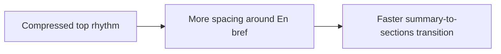

## item_032_day_captain_digest_top_spacing_and_summary_rhythm_polish - Day Captain digest top spacing and summary rhythm polish
> From version: 1.2.0
> Status: In Progress
> Understanding: 97%
> Confidence: 95%
> Progress: 75%
> Complexity: Low
> Theme: UX
> Reminder: Update status/understanding/confidence/progress and linked task references when you edit this doc.

# Problem
- The top of the digest is materially cleaner than before, but it still feels visually compressed in Outlook.
- There is not enough space between `Périmètre` and `En bref`.
- There is not enough space between the `En bref` text block and the next section header, which hurts rhythm at the exact point where the user should transition from summary to detailed sections.

# Scope
- In:
  - add more breathing room between the coverage/perimeter line and the `En bref` label
  - add more breathing room between the `En bref` body text and the next section header
  - preserve the current header structure and summary behavior
- Out:
  - redesigning the content of `En bref`
  - changing lower-section card styling in depth
  - changing delivery, recall, or scoring behavior

# Acceptance criteria
- AC1: There is visibly more space between the `Périmètre` line and the `En bref` label/block in Outlook.
- AC2: There is visibly more space between the `En bref` paragraph and the next downstream section header.
- AC3: The top of the digest remains compact overall and does not regress into a heavy hero block.

# AC Traceability
- Req023 AC1 -> Scope includes spacing between perimeter and `En bref`. Proof: item explicitly adds top-of-mail breathing room.
- Req023 AC2 -> Scope includes spacing between the summary body and the next section. Proof: item explicitly restores section rhythm after `En bref`.
- Req023 AC7 -> Scope preserves the current compact layout. Proof: item explicitly avoids reintroducing a heavy top block.

# Links
- Request: `req_023_day_captain_digest_spacing_and_content_cleanup_polish`
- Primary task(s): `task_028_day_captain_digest_spacing_and_content_cleanup_orchestration` (`In Progress`)

# Priority
- Impact: Medium - this is a small visual change, but it affects the most visible part of the mail.
- Urgency: Medium - final polish issue discovered in live Outlook review.

# Notes
- Derived from another live Outlook review on Monday, March 9, 2026.
- Implementation is underway: the renderer top spacing around `Périmètre`, `En bref`, and the first downstream section is now being loosened without reintroducing a heavy hero block.
