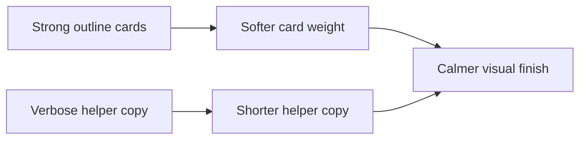

## item_033_day_captain_digest_card_weight_and_footer_microcopy_polish - Day Captain digest card weight and footer microcopy polish
> From version: 1.2.0
> Status: In Progress
> Understanding: 97%
> Confidence: 95%
> Progress: 70%
> Complexity: Low
> Theme: UX
> Reminder: Update status/understanding/confidence/progress and linked task references when you edit this doc.

# Problem
- The current card treatment is acceptable, but the white borders still feel slightly too strong in Outlook.
- The footer quick-action helper copy is functionally correct, yet it takes more space and attention than necessary for a supporting hint.

# Scope
- In:
  - slightly soften card border contrast or weight while preserving scannability
  - shorten the quick-action helper copy while keeping the “opens a draft” meaning clear
  - preserve the current footer action contract and button structure
- Out:
  - removing the quick-action footer
  - redesigning the button model
  - changing any command semantics

# Acceptance criteria
- AC1: Section cards remain readable but use slightly softer visual weight than the current strong white-outline treatment.
- AC2: The footer helper copy is shorter and less visually dominant while remaining explicit about draft behavior.
- AC3: The footer buttons remain Outlook-compatible and functionally unchanged.

# AC Traceability
- Req023 AC3 -> Scope includes softer card weight. Proof: item explicitly reduces border/outline visual heaviness.
- Req023 AC4 -> Scope includes shorter helper copy. Proof: item explicitly tightens footer microcopy without losing intent.
- Req023 AC7 -> Scope preserves the current contract and layout. Proof: item explicitly keeps the footer behavior intact.

# Links
- Request: `req_023_day_captain_digest_spacing_and_content_cleanup_polish`
- Primary task(s): `task_028_day_captain_digest_spacing_and_content_cleanup_orchestration` (`In Progress`)

# Priority
- Impact: Medium - subtle but visible final-finish issue.
- Urgency: Medium - final polish item after live Outlook validation.

# Notes
- Derived from the same March 9, 2026 Outlook review as `req_023`.
- Implementation is underway: card borders are being softened slightly and the footer helper copy is being tightened while the draft-action meaning stays explicit.
- A later live review confirmed that these visual details are now secondary to wording quality; they remain worth polishing, but they are no longer the main blocker.
