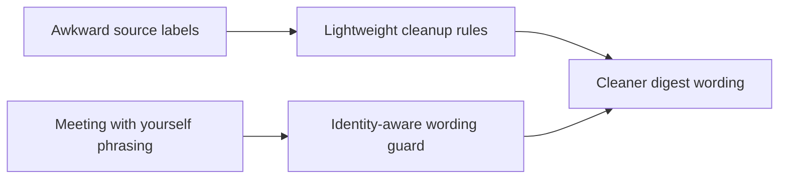

## item_034_day_captain_digest_identity_aware_wording_and_label_cleanup - Day Captain digest identity-aware wording and label cleanup
> From version: 1.2.0
> Status: In Progress
> Understanding: 97%
> Confidence: 95%
> Progress: 70%
> Complexity: Medium
> Theme: UX
> Reminder: Update status/understanding/confidence/progress and linked task references when you edit this doc.

# Problem
- Some rendered labels or titles still look rough when copied too directly from source data.
- Meeting wording can still become awkward when the target user is recognized in several roles, leading to output that implies the user has a meeting with themselves.

# Scope
- In:
  - add lightweight cleanup rules for a few obvious rough labels or titles
  - add identity-aware wording guards so the target user is not framed as a separate notable participant
  - preserve the underlying message and meeting meaning while improving readability
- Out:
  - building a general-purpose rewrite layer for all source content
  - changing meeting selection or scoring
  - changing the underlying user model or auth model

# Acceptance criteria
- AC1: Obvious awkward labels or raw source-derived titles are normalized when a lightweight cleanup rule improves readability without changing meaning.
- AC2: Meeting and summary wording no longer describe the target user as meeting with themselves when the same identity appears in event metadata.
- AC3: The cleanup rules stay bounded and do not become a broad uncontrolled rewriting layer.

# AC Traceability
- Req023 AC5 -> Scope includes label/title cleanup. Proof: item explicitly targets obvious rough labels.
- Req023 AC6 -> Scope includes identity-aware wording. Proof: item explicitly prevents self-reference meeting phrasing.
- Req023 AC7 -> Scope stays bounded. Proof: item explicitly avoids introducing a broad rewrite system.

# Links
- Request: `req_023_day_captain_digest_spacing_and_content_cleanup_polish`
- Primary task(s): `task_028_day_captain_digest_spacing_and_content_cleanup_orchestration` (`In Progress`)

# Priority
- Impact: High - self-reference mistakes harm trust quickly even if they are rare.
- Urgency: Medium - polish issue, but noticeable in live use.

# Notes
- Derived from the March 9, 2026 Outlook review and direct operator feedback.
- Implementation is underway: bounded cleanup rules are being added for rough labels such as `A imprimer`, and meeting wording now starts to guard against self-reference phrasing when the organizer matches the target user.
