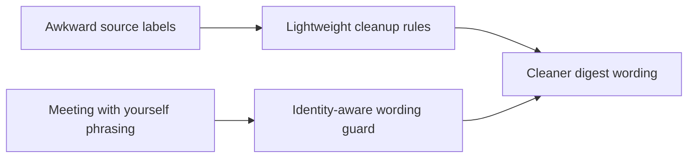

## item_034_day_captain_digest_identity_aware_wording_and_label_cleanup - Day Captain digest identity-aware wording and label cleanup
> From version: 1.2.0
> Status: In Progress
> Understanding: 98%
> Confidence: 96%
> Progress: 97%
> Complexity: Medium
> Theme: UX
> Reminder: Update status/understanding/confidence/progress and linked task references when you edit this doc.

# Problem
- Some rendered labels or titles still look rough when copied too directly from source data.
- Meeting wording can still become awkward when the target user is recognized in several roles, leading to output that implies the user has a meeting with themselves.
- After the first self-reference guard was added, some meeting summaries became too thin, and `En bref` can still use vague or awkward phrasing around upcoming meetings.
- Some section-card summaries still read too literally, as if they were compressed source text rather than bounded assistant copy.

# Scope
- In:
  - add lightweight cleanup rules for a few obvious rough labels or titles
  - add identity-aware wording guards so the target user is not framed as a separate notable participant
  - improve meeting fallback wording when organizer identity is intentionally suppressed
  - improve `En bref` meeting phrasing so it stays natural and specific
  - compress overly literal section-card summaries when a bounded deterministic rewrite is sufficient
  - preserve the underlying message and meeting meaning while improving readability
- Out:
  - building a general-purpose rewrite layer for all source content
  - changing meeting selection or scoring
  - changing the underlying user model or auth model

# Acceptance criteria
- AC1: Obvious awkward labels or raw source-derived titles are normalized when a lightweight cleanup rule improves readability without changing meaning.
- AC2: Meeting and summary wording no longer describe the target user as meeting with themselves when the same identity appears in event metadata.
- AC3: Meeting fallback wording remains informative after identity cleanup and does not collapse into thin time/location-only phrasing unless that is genuinely the only useful signal.
- AC4: `En bref` and section-card summaries become more natural when a bounded cleanup rule can improve literal or awkward wording.
- AC5: The cleanup rules stay bounded and do not become a broad uncontrolled rewriting layer.

# AC Traceability
- Req023 AC5 -> Scope includes label/title cleanup. Proof: item explicitly targets obvious rough labels.
- Req023 AC6 -> Scope includes identity-aware wording. Proof: item explicitly prevents self-reference meeting phrasing.
- Req023 AC7 -> Scope includes overview and meeting fallback quality after identity cleanup. Proof: item explicitly improves those wording paths.
- Req023 AC8 -> Scope stays bounded. Proof: item explicitly avoids introducing a broad rewrite system.

# Links
- Request: `req_023_day_captain_digest_spacing_and_content_cleanup_polish`
- Primary task(s): `task_028_day_captain_digest_spacing_and_content_cleanup_orchestration` (`In Progress`)

# Priority
- Impact: High - self-reference mistakes harm trust quickly even if they are rare.
- Urgency: Medium - polish issue, but noticeable in live use.

# Notes
- Derived from the March 9, 2026 Outlook review and direct operator feedback.
- Implementation is underway: bounded cleanup rules are being added for rough labels such as `A imprimer`, meeting wording now starts to guard against self-reference phrasing when the organizer matches the target user, and the next focus is better overview/meeting fallback phrasing.
- The current slice now also tightens the LLM wording path so summaries repeat titles less often and `En bref` gets stronger meeting-specific guidance.
- The latest local slice also keeps `Suivi` / `Next step` cues when long rewritten summaries are compacted, so the wording cleanup stays concise without losing the actionable tail.
- `En bref` input is now being compacted before the LLM overview call as well, so verbose candidate/profile summaries are less likely to leak long machine-like detail into the top block.
- The newest local pass also applies bounded candidate/profile compression and light top-summary phrase cleanup, so outputs such as “la prochaine a lieu” or long profile recaps are pushed toward shorter assistant-style phrasing.
