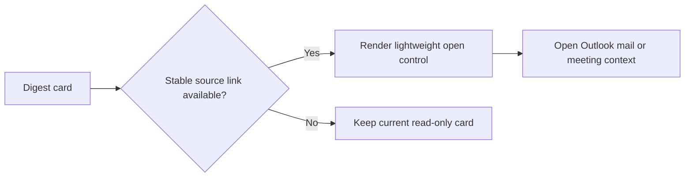

## item_035_day_captain_digest_source_open_controls - Day Captain digest source open controls
> From version: 1.2.1
> Status: Done
> Understanding: 100%
> Confidence: 99%
> Progress: 100%
> Complexity: Medium
> Theme: UX
> Reminder: Update status/understanding/confidence/progress and linked task references when you edit this doc.

# Problem
- The digest now highlights useful messages and meetings, but the user still has to manually find the underlying Outlook source to act on them.
- This creates extra friction precisely when the digest has already done the work of surfacing the right card.
- Calendar events already carry a normalized `join_url` or `webLink` candidate in the ingestion layer, but the renderer does not expose it yet.
- Mail items do not yet expose an equivalent stable open link in the delivered digest, so the current behavior is asymmetric and incomplete.

# Scope
- In:
  - evaluate lightweight Outlook-compatible controls for opening the source meeting or mail from digest cards
  - use already-known source links first, rather than inventing a new action system
  - keep the controls visually secondary to the digest content
  - document any link-availability limitations clearly if mail and meeting support differ
- Out:
  - redesigning digest scoring, transport, or selection
  - introducing a full interactive action layer
  - guaranteeing identical link behavior across every Outlook client if the source platform does not support it

# Acceptance criteria
- AC1: Meeting cards can expose a lightweight open control when a stable Outlook-compatible meeting link is already available.
- AC2: Mail cards expose a lightweight open control only if a stable Outlook-compatible source link can be derived without changing the delivery contract.
- AC3: If mail and meeting link support differ, the limitation is explicit in docs and the UI stays coherent rather than partially broken.
- AC4: The controls remain visually secondary and do not overload the existing digest layout.

# AC Traceability
- Req023 AC9 -> Scope explicitly evaluates or implements bounded source-opening controls. Proof: item covers mail/meeting open actions without changing digest behavior.

# Links
- Request: `req_023_day_captain_digest_spacing_and_content_cleanup_polish`
- Primary task(s): `task_028_day_captain_digest_spacing_and_content_cleanup_orchestration` (`In Progress`)

# Priority
- Impact: Medium - direct source access improves the usefulness of cards that are already correctly shortlisted.
- Urgency: Medium - not a blocker for digest readability, but a strong usability improvement.

# Notes
- Derived from direct operator feedback on Monday, March 9, 2026 after live Outlook usage.
- The likely first step is to expose meeting links, because the ingestion layer already normalizes `join_url` / `webLink`; mail-link support may require separate discovery or a documented limitation.
- Implementation is now underway locally:
  - `DigestEntry` can carry a bounded `source_url`
  - meeting cards now prefer a Graph `webLink` when available and otherwise fall back to `join_url`
  - message cards can expose an Outlook open control when Graph returns `webLink`
  - the renderer shows these controls as small secondary links rather than heavy new buttons
- Closed on Monday, March 9, 2026 after the live `1.2.2` Outlook validation accepted these lightweight controls as the right bounded behavior for meetings and link-capable messages.
