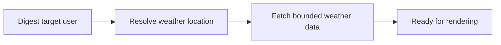

## item_036_day_captain_digest_weather_source_and_location_contract - Define the digest weather source and location contract
> From version: 1.3.0
> Status: Ready
> Understanding: 97%
> Confidence: 94%
> Progress: 0%
> Complexity: Medium
> Theme: UX
> Reminder: Update status/understanding/confidence/progress and linked task references when you edit this doc.

# Problem
- A weather capsule is only useful if the digest knows which place it should describe and which upstream provider it trusts.
- Without an explicit contract, the implementation risks guessing the wrong city or coupling the digest to an unstable ad hoc weather integration.

# Scope
- In:
  - define how a digest run resolves its weather location
  - define the bounded provider contract needed for current-day and previous-day comparison
  - keep the dependency optional so digest delivery still works without weather data
- Out:
  - rendering the capsule itself
  - building a broad geolocation system
  - turning weather into a required dependency for digest generation

# Acceptance criteria
- AC1: One explicit location-resolution contract exists for weather lookup per digest run.
- AC2: The upstream weather dependency can provide enough data for today plus a bounded warmer/cooler comparison versus yesterday.
- AC3: The contract stays optional so missing weather configuration does not block digest delivery.

# AC Traceability
- Req024 AC6 -> Scope defines the new dependency/location contract. Proof: item explicitly freezes the provider and location expectations.

# Links
- Request: `req_024_day_captain_digest_daily_weather_capsule`
- Primary task(s): `task_029_day_captain_digest_weather_capsule_orchestration` (`Ready`)

# Priority
- Impact: High - the capsule cannot be trustworthy without a clear source/location contract.
- Urgency: Medium - first implementation step for the weather slice.

# Notes
- Derived from `req_024_day_captain_digest_daily_weather_capsule`.
- This slice should stay bounded: one digest-ready location contract, not a generalized weather platform.
