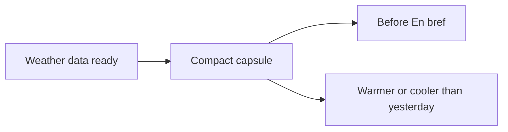

## item_037_day_captain_digest_weather_capsule_rendering_and_copy - Render the weather capsule before En bref
> From version: 1.3.0
> Status: Done
> Understanding: 100%
> Confidence: 98%
> Progress: 100%
> Complexity: Medium
> Theme: UX
> Reminder: Update status/understanding/confidence/progress and linked task references when you edit this doc.

# Problem
- The digest top block now has room for one compact contextual signal, but weather only adds value if it stays short and visually light.
- A weather block that is too verbose or too prominent would regress the header polish achieved in the earlier digest passes.

# Scope
- In:
  - render one compact weather capsule before `En bref`
  - summarize the day’s weather in short assistant-style wording
  - include a bounded warmer/cooler comparison against the previous local day
  - preserve the current top-of-mail reading rhythm
- Out:
  - multi-day forecast expansion
  - heavy visual treatments or image-based weather widgets
  - detailed meteorological reporting

# Acceptance criteria
- AC1: The delivered digest renders a weather capsule before `En bref`.
- AC2: The capsule wording stays brief and useful rather than report-like.
- AC3: The capsule includes a short warmer/cooler signal versus the previous local day when the data exists.
- AC4: The weather capsule remains visually light and does not dominate the top of the mail.

# AC Traceability
- Req024 AC1 -> Scope explicitly adds the capsule before `En bref`. Proof: item targets the top-of-mail placement.
- Req024 AC2 -> Scope explicitly keeps the wording brief. Proof: item bounds the weather copy style.
- Req024 AC3 -> Scope explicitly adds the warmer/cooler comparison. Proof: item includes that delta in the rendered capsule.
- Req024 AC5 -> Scope explicitly preserves the lighter header feel. Proof: item keeps the capsule visually subordinate.

# Links
- Request: `req_024_day_captain_digest_daily_weather_capsule`
- Primary task(s): `task_029_day_captain_digest_weather_capsule_orchestration` (`Done`)

# Priority
- Impact: High - this is the visible user-facing outcome of the weather slice.
- Urgency: Medium - second implementation step after the data contract is clear.

# Notes
- Derived from `req_024_day_captain_digest_daily_weather_capsule`.
- The warmer/cooler comparison should stay intentionally simple rather than pretending to be precise planning intelligence.
- Completed with a compact capsule rendered before `En bref`, using deterministic copy and a bounded warmer/cooler-than-yesterday signal.
