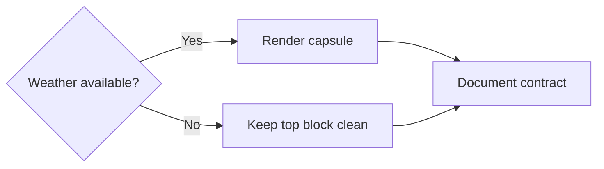

## item_038_day_captain_digest_weather_fallback_and_docs_validation - Keep the weather capsule fallback-safe and document it
> From version: 1.3.0
> Status: Ready
> Understanding: 97%
> Confidence: 94%
> Progress: 0%
> Complexity: Low
> Theme: UX
> Reminder: Update status/understanding/confidence/progress and linked task references when you edit this doc.

# Problem
- External weather data can be missing, incomplete, or temporarily unavailable.
- Without a bounded fallback path, the digest top layout could become fragile or visually awkward.
- If new config is introduced for weather location/provider, that contract must be documented before the slice can close cleanly.

# Scope
- In:
  - keep the digest top block stable when weather data is missing
  - define the capsule no-op behavior when weather cannot be resolved
  - update docs/config notes before closure
  - validate the final rendered result after weather is added
- Out:
  - retry-heavy weather orchestration
  - complex degraded weather summaries from partial raw data
  - turning provider outages into delivery blockers

# Acceptance criteria
- AC1: If weather data is unavailable, the digest still renders cleanly without breaking the top layout.
- AC2: Any new weather configuration or provider contract is documented before the slice closes.
- AC3: The final weather-enhanced rendering is validated after implementation.

# AC Traceability
- Req024 AC4 -> Scope explicitly keeps rendering stable without weather data. Proof: item defines the no-data fallback.
- Req024 AC6 -> Scope explicitly requires docs updates. Proof: item blocks closure until contract docs are updated.

# Links
- Request: `req_024_day_captain_digest_daily_weather_capsule`
- Primary task(s): `task_029_day_captain_digest_weather_capsule_orchestration` (`Ready`)

# Priority
- Impact: Medium - fallback safety and docs quality determine whether the weather slice is safe to ship.
- Urgency: Medium - closure slice after provider and rendering work.

# Notes
- Derived from `req_024_day_captain_digest_daily_weather_capsule`.
- This slice is explicitly about graceful degradation, not about building a richer weather feature set.
