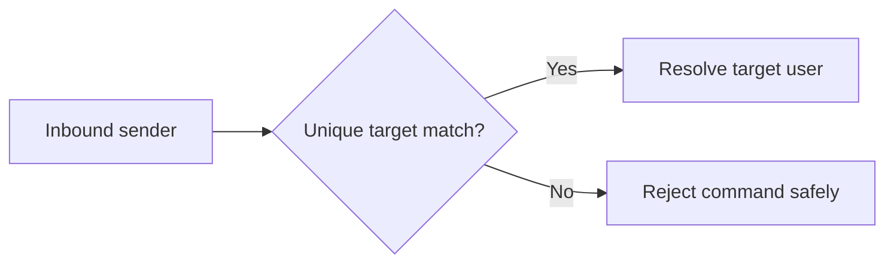

## item_039_day_captain_multi_user_email_command_mapping_contract - Define the sender-to-target mapping contract for hosted multi-user email-command recall
> From version: 1.3.0
> Status: Done
> Understanding: 98%
> Confidence: 96%
> Progress: 100%
> Complexity: Medium
> Theme: Operations
> Reminder: Update status/understanding/confidence/progress and linked task references when you edit this doc.

# Problem
- Hosted email-command recall currently assumes exactly one configured target user, which avoids ambiguity but blocks the feature entirely in multi-user deployments.
- As soon as more than one hosted target user exists, the system needs a clear and explicit way to decide which user an inbound recall command should target.
- Without a bounded routing contract, the product risks guessing wrong and sending a recall response for the wrong mailbox.

# Scope
- In:
  - define how one inbound sender resolves to one hosted target user
  - define which sender patterns are valid in multi-user mode
  - require explicit rejection when the mapping is ambiguous or missing
- Out:
  - rendering changes to the digest itself
  - broad mailbox routing beyond recall commands
  - permissive fallback behavior such as "first configured user wins"

# Acceptance criteria
- AC1: One explicit sender-to-target mapping contract exists for hosted multi-user email-command recall.
- AC2: The mapping can resolve one sender to exactly one configured target user.
- AC3: Missing or ambiguous mappings are rejected safely rather than guessed.

# AC Traceability
- Req025 AC2 -> Scope explicitly defines sender-to-target routing. Proof: item freezes the hosted mapping contract.
- Req025 AC3 -> Scope explicitly rejects ambiguous routing. Proof: item blocks silent fallback behavior.

# Links
- Request: `req_025_day_captain_multi_user_email_command_recall`
- Primary task(s): `task_030_day_captain_multi_user_email_command_recall_orchestration` (`Done`)

# Priority
- Impact: High - multi-user recall is unsafe without a precise routing contract.
- Urgency: High - first implementation step because validation/runtime changes depend on this rule.

# Notes
- Derived from `req_025_day_captain_multi_user_email_command_recall`.
- Preferred direction: reuse sender identity first, then allow helper senders only when they can be bound unambiguously to one target user.
- Implemented by resolving every configured target user as an implicit self-route and allowing helper senders in multi-user mode only through explicit `sender=target` mappings.
