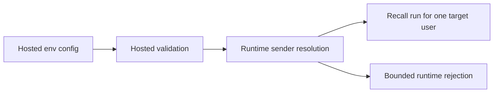

## item_040_day_captain_multi_user_email_command_validation_and_runtime - Enable valid hosted multi-user email-command recall at validation/runtime
> From version: 1.3.0
> Status: Ready
> Understanding: 98%
> Confidence: 96%
> Progress: 0%
> Complexity: Medium
> Theme: Operations
> Reminder: Update status/understanding/confidence/progress and linked task references when you edit this doc.

# Problem
- The current hosted validation path blocks service startup whenever `DAY_CAPTAIN_EMAIL_COMMAND_ALLOWED_SENDERS` is set alongside more than one hosted target user.
- That means a valid multi-user hosted deployment can deliver scheduled digests correctly but cannot even boot if operators want bounded recall support.
- The runtime contract needs to distinguish "unsafe config" from "safe multi-user config with explicit sender routing".

# Scope
- In:
  - update hosted validation rules so safe multi-user recall configs are allowed
  - implement runtime resolution based on the frozen sender-to-target mapping contract
  - preserve the current single-user behavior for existing deployments
  - keep explicit runtime failure when a sender is not allowed or cannot be resolved uniquely
- Out:
  - changing scheduler fan-out behavior
  - changing digest delivery routing
  - broadening recall beyond the existing bounded command set

# Acceptance criteria
- AC1: Hosted validation no longer blocks boot for a valid multi-user recall configuration.
- AC2: Runtime sender resolution follows the explicit mapping contract and resolves to exactly one target user.
- AC3: Existing single-user email-command behavior still works without requiring a new config shape.
- AC4: Invalid or ambiguous sender configurations still fail explicitly.

# AC Traceability
- Req025 AC1 -> Scope explicitly unblocks valid hosted multi-user boot/runtime behavior. Proof: item updates validation rules.
- Req025 AC4 -> Scope explicitly preserves single-user behavior. Proof: item treats current single-user hosted recall as a compatibility path.

# Links
- Request: `req_025_day_captain_multi_user_email_command_recall`
- Primary task(s): `task_030_day_captain_multi_user_email_command_recall_orchestration` (`Ready`)

# Priority
- Impact: High - this is the actual code/runtime change that removes the current hosted failure.
- Urgency: High - second implementation step after the routing contract is frozen.

# Notes
- Derived from `req_025_day_captain_multi_user_email_command_recall`.
- This slice should stay narrow: allow safe multi-user recall, not broaden the email-command feature set unnecessarily.
