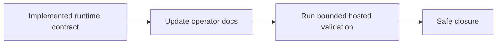

## item_041_day_captain_multi_user_email_command_ops_docs_and_validation - Document and validate hosted multi-user email-command recall
> From version: 1.3.0
> Status: Ready
> Understanding: 97%
> Confidence: 95%
> Progress: 0%
> Complexity: Low
> Theme: Operations
> Reminder: Update status/understanding/confidence/progress and linked task references when you edit this doc.

# Problem
- Even with a safe implementation, operators still need a clear explanation of how to configure sender routing in Render and in the private ops repo.
- Multi-user recall also needs a final validation step to confirm the bounded sender-to-target behavior works as documented.
- Without that docs/validation pass, the new contract remains easy to misconfigure.

# Scope
- In:
  - document the new hosted multi-user email-command recall contract
  - document how it differs from the existing single-user setup
  - validate at least one live or operator-grade multi-user recall scenario after implementation
  - document explicit failure modes when sender mapping is ambiguous
- Out:
  - building a new admin UI for config management
  - broad operational automation beyond the existing docs/runbooks
  - replacing the private ops scheduler model

# Acceptance criteria
- AC1: Hosted/operator docs explain the multi-user email-command recall contract and its configuration shape.
- AC2: The docs explain the safe failure mode for ambiguous sender mappings.
- AC3: The new hosted multi-user recall path is validated after implementation.

# AC Traceability
- Req025 AC5 -> Scope explicitly updates docs and operator guidance. Proof: item blocks closure until the new contract is documented and validated.

# Links
- Request: `req_025_day_captain_multi_user_email_command_recall`
- Primary task(s): `task_030_day_captain_multi_user_email_command_recall_orchestration` (`Ready`)

# Priority
- Impact: Medium - docs and validation determine whether the new multi-user contract is operable in production.
- Urgency: Medium - closure slice after routing and runtime support land.

# Notes
- Derived from `req_025_day_captain_multi_user_email_command_recall`.
- This slice is explicitly about making the new hosted contract operable and understandable, not about expanding the feature further.
