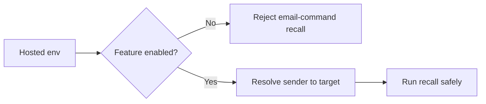

## item_042_day_captain_email_command_enablement_contract_alignment - Align hosted email-command enablement with the documented contract
> From version: 1.3.1
> Status: Ready
> Understanding: 98%
> Confidence: 96%
> Progress: 0%
> Complexity: Medium
> Theme: Reliability
> Reminder: Update status/understanding/confidence/progress and linked task references when you edit this doc.

# Problem
- The hosted docs currently say inbound email-command recall should be treated as enabled only when `DAY_CAPTAIN_EMAIL_COMMAND_ALLOWED_SENDERS` is configured.
- The runtime currently seeds self-routes for configured target users even when that env var is empty, so the feature can still be reachable when operators believe it is off.
- That mismatch weakens the hosted contract and makes operational disablement non-trustworthy.

# Scope
- In:
  - decide the intended enablement contract for hosted email-command recall
  - enforce the same contract in validation and runtime resolution
  - keep bounded sender-to-target routing safe when the feature is enabled
- Out:
  - redesigning the recall command set
  - adding new mailbox routing features
  - changing scheduler behavior

# Acceptance criteria
- AC1: Hosted runtime rejects email-command recall when the feature is configured as disabled.
- AC2: Validation summary and docs report the same enablement behavior as runtime.
- AC3: Enabled multi-user sender routing remains explicit and unambiguous.

# AC Traceability
- Req026 AC1 -> Scope explicitly aligns runtime enablement with the documented contract. Proof: item removes the current mismatch.
- Req026 AC2 -> Scope explicitly aligns validation/runtime/docs. Proof: item is about contract consistency, not just code.

# Links
- Request: `req_026_day_captain_runtime_contract_and_digest_cursor_reliability`
- Primary task(s): `task_031_day_captain_runtime_contract_and_digest_cursor_reliability_orchestration` (`Ready`)

# Priority
- Impact: High - operators cannot safely trust hosted recall enablement until the contract is consistent.
- Urgency: High - this is a direct correctness and operational safety issue.

# Notes
- Derived from `req_026_day_captain_runtime_contract_and_digest_cursor_reliability`.
- Preferred outcome: one explicit enablement rule with no hidden self-route fallback when the feature is documented as off.
