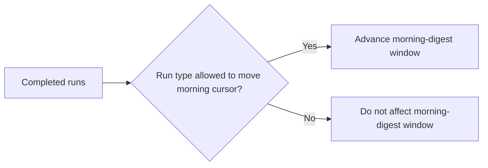

## item_043_day_captain_morning_digest_cursor_run_type_isolation - Isolate the morning-digest incremental cursor from unrelated run types
> From version: 1.3.1
> Status: Done
> Understanding: 100%
> Confidence: 99%
> Progress: 100%
> Complexity: Medium
> Theme: Reliability
> Reminder: Update status/understanding/confidence/progress and linked task references when you edit this doc.

# Problem
- `morning-digest` currently advances from the latest completed run regardless of run type.
- That lets `weekly-digest` and `recall-digest` move the next `morning-digest` window forward even though they should not act as incremental cursors for the weekday morning flow.
- The most visible impact is on Monday or first-run backlog behavior, where part of the expected Friday-through-Monday mail window can be skipped.

# Scope
- In:
  - define which run types may advance the `morning-digest` cursor
  - stop `weekly-digest` and `recall-digest` from moving that cursor
  - preserve intended incremental behavior across repeated `morning-digest` runs
- Out:
  - changing the weekly digest business window itself
  - changing recall payload semantics
  - redesigning digest storage schema beyond what is needed for cursor correctness

# Acceptance criteria
- AC1: `morning-digest` advances incrementally only from the intended run types.
- AC2: `weekly-digest` and `recall-digest` no longer suppress the expected Monday/first-run backlog window.
- AC3: Automated tests cover the corrected cursor behavior.

# AC Traceability
- Req026 AC3 -> Scope explicitly isolates the morning cursor from unrelated run types. Proof: item prevents weekly/recall drift.
- Req026 AC5 -> Scope explicitly requires test coverage. Proof: item closes only when cursor behavior is covered.

# Links
- Request: `req_026_day_captain_runtime_contract_and_digest_cursor_reliability`
- Primary task(s): `task_031_day_captain_runtime_contract_and_digest_cursor_reliability_orchestration` (`Done`)

# Priority
- Impact: High - this can silently skip real user mail from the intended digest horizon.
- Urgency: High - it affects correctness of delivered digests, especially on Monday.

# Notes
- Derived from `req_026_day_captain_runtime_contract_and_digest_cursor_reliability`.
- The fix should be explicit about run-type semantics rather than relying on implicit ordering.
- Closed on Monday, March 9, 2026 after filtering the incremental cursor to `morning_digest` runs only and adding regression coverage for Monday backlog behavior after weekly runs.
