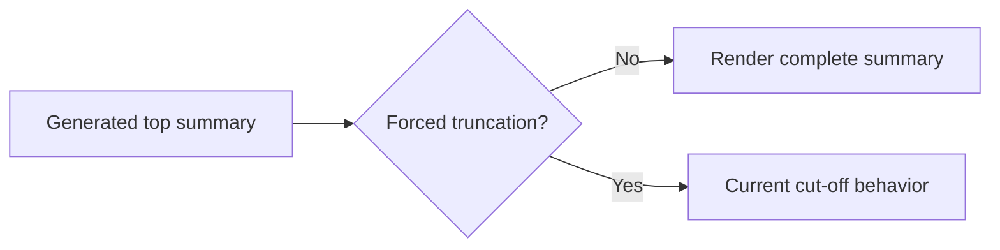

## item_045_day_captain_overview_length_policy_without_truncation - Remove forced top-summary truncation and define the new overview-length contract
> From version: 1.3.1
> Status: Ready
> Understanding: 98%
> Confidence: 96%
> Progress: 0%
> Complexity: Medium
> Theme: Product
> Reminder: Update status/understanding/confidence/progress and linked task references when you edit this doc.

# Problem
- The current application policy bounds `En bref` / `In brief` to keep the top of the digest compact.
- That means a useful long summary can be cut off even when the operator explicitly prefers completeness over brevity.
- The product now needs a different contract: if the summary is long, it should still be shown in full rather than forcibly truncated.

# Scope
- In:
  - remove or redefine the current forced summary truncation policy
  - preserve complete top-summary content in the delivered digest
  - ensure docs and tests reflect the new “not forcibly limited” contract
- Out:
  - broad redesign of the digest top area
  - guaranteeing perfect summary quality from the LLM layer
  - unrelated section-card styling changes

# Acceptance criteria
- AC1: The application no longer forcibly truncates the top summary.
- AC2: Delivered digests preserve the complete summary text generated by the selected summary engine.
- AC3: Tests and docs are updated to reflect the new summary-length policy.

# AC Traceability
- Req027 AC1 -> Scope explicitly removes forced truncation. Proof: item changes the overview-length contract itself.
- Req027 AC4 -> Scope explicitly requires docs/tests updates. Proof: item closes only when the new contract is documented.

# Links
- Request: `req_027_day_captain_overview_flagged_signal_and_desktop_opening`
- Primary task(s): `task_032_day_captain_overview_flagged_signal_and_desktop_opening_orchestration` (`Ready`)

# Priority
- Impact: Medium - users lose trust in the executive recap when it is visibly cut off.
- Urgency: High - this is direct feedback on a visible delivered artifact.

# Notes
- Derived from `req_027_day_captain_overview_flagged_signal_and_desktop_opening`.
- The intended change is policy-level: long summaries are acceptable if they remain useful.
