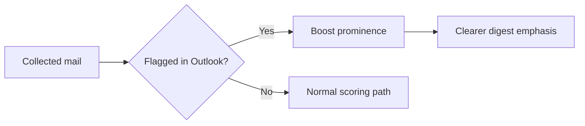

## item_046_day_captain_flagged_mail_signal_and_rendering_prominence - Promote flagged emails more clearly in scoring and rendering
> From version: 1.3.1
> Status: Ready
> Understanding: 98%
> Confidence: 96%
> Progress: 0%
> Complexity: Medium
> Theme: Product
> Reminder: Update status/understanding/confidence/progress and linked task references when you edit this doc.

# Problem
- Flagged mail currently behaves like any other message flowing through the scoring pipeline.
- That means a flagged message may not stand out enough even though it represents explicit user intent inside Outlook.
- The digest should treat a flagged message as a stronger signal than a generic watch item.

# Scope
- In:
  - detect flagged mail reliably from the collected message data
  - promote flagged mail in scoring and/or rendering
  - define the bounded visual or textual emphasis used in the delivered digest
- Out:
  - replacing all existing prioritization logic with a flags-only model
  - inventing a new feedback system outside existing Outlook signals
  - unrelated LLM wording changes except when needed to preserve the flagged signal

# Acceptance criteria
- AC1: Flagged mail is detected and given stronger prominence than ordinary messages.
- AC2: The delivered digest makes flagged items visibly easier to spot.
- AC3: The treatment stays bounded and does not let flagged noise overwhelm the digest.

# AC Traceability
- Req027 AC2 -> Scope explicitly promotes flagged messages in scoring/rendering. Proof: item is the dedicated flagged-signal slice.
- Req027 AC4 -> Closure requires the new treatment to be tested/documented. Proof: the signal is product-facing and must be stable.

# Links
- Request: `req_027_day_captain_overview_flagged_signal_and_desktop_opening`
- Primary task(s): `task_032_day_captain_overview_flagged_signal_and_desktop_opening_orchestration` (`Ready`)

# Priority
- Impact: High - flags encode explicit user attention and should be reflected strongly in the digest.
- Urgency: High - this is direct product-value feedback on ranking usefulness.

# Notes
- Derived from `req_027_day_captain_overview_flagged_signal_and_desktop_opening`.
- Preferred direction: boost plus bounded visual emphasis before introducing a whole new section.
