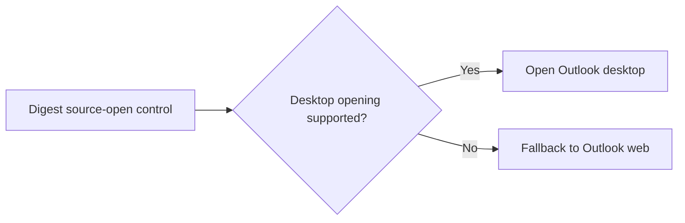

## item_047_day_captain_outlook_desktop_opening_behavior_and_fallbacks - Define and validate Outlook desktop opening behavior with reliable fallback
> From version: 1.3.1
> Status: Ready
> Understanding: 97%
> Confidence: 95%
> Progress: 0%
> Complexity: Medium
> Theme: Product
> Reminder: Update status/understanding/confidence/progress and linked task references when you edit this doc.

# Problem
- Current source-open controls are web-oriented and reliably open Outlook web contexts when a stable link exists.
- There is product interest in opening Outlook desktop directly when the client is available.
- That behavior is less universal than web links and needs an explicit support/fallback contract rather than an implicit best-effort guess.

# Scope
- In:
  - evaluate whether desktop-protocol or deep-link behavior is feasible from the delivered digest
  - define the supported behavior and fallback path when desktop opening is unavailable
  - update docs and validation notes for the chosen contract
- Out:
  - guaranteeing uniform desktop-opening behavior across all platforms and mail clients
  - replacing safe web links with a desktop-only mechanism
  - redesigning the full source-open UX beyond what is needed for this contract

# Acceptance criteria
- AC1: The supported desktop-opening behavior is explicit rather than implied.
- AC2: The digest preserves a reliable fallback when desktop opening is unavailable or unsupported.
- AC3: Docs and validation notes explain the real supported behavior and limits.

# AC Traceability
- Req027 AC3 -> Scope explicitly defines desktop-versus-web behavior. Proof: item is about the opening contract itself.
- Req027 AC4 -> Scope explicitly updates docs/validation. Proof: operator and user expectations depend on the final supported behavior.

# Links
- Request: `req_027_day_captain_overview_flagged_signal_and_desktop_opening`
- Primary task(s): `task_032_day_captain_overview_flagged_signal_and_desktop_opening_orchestration` (`Ready`)

# Priority
- Impact: Medium - this affects convenience and platform integration, not the correctness of digest content.
- Urgency: Medium - useful follow-up, but less critical than summary policy and flagged prominence.

# Notes
- Derived from `req_027_day_captain_overview_flagged_signal_and_desktop_opening`.
- A fallback-first contract is preferred over a fragile desktop-only path.
