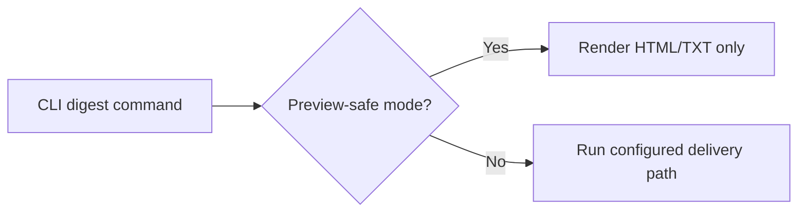

## item_048_day_captain_preview_safe_rendering_contract - Introduce a true preview-safe rendering path without unintended Graph send
> From version: 1.4.0
> Status: Done
> Understanding: 100%
> Confidence: 99%
> Progress: 100%
> Complexity: Medium
> Theme: Reliability
> Reminder: Update status/understanding/confidence/progress and linked task references when you edit this doc.

# Problem
- The current preview export flags `--output-html` and `--output-text` only write files after the selected command has already executed.
- If the configured delivery mode resolves to `graph_send`, a user can trigger a real send while believing they are only generating a preview.
- That weakens operator safety and makes local preview behavior harder to trust.

# Scope
- In:
  - define a preview-safe rendering contract that does not send mail
  - make that contract explicit on the CLI and in the local workflow docs
  - ensure preview export remains available for morning, weekly, recall, and inbound command paths when appropriate
- Out:
  - redesigning the full CLI surface
  - changing digest rendering output formats beyond what is needed for safe preview
  - unrelated hosted runtime changes

# Acceptance criteria
- AC1: A documented preview-safe path exists and does not trigger Graph send.
- AC2: Preview export works without relying on the configured delivery mode being `json`.
- AC3: Tests and docs reflect the real preview contract.

# AC Traceability
- Req028 AC1 -> Scope explicitly adds a no-send preview path. Proof: item is the preview-safety slice itself.
- Req028 AC2 -> Scope explicitly aligns CLI/docs with the actual contract. Proof: misleading preview assumptions are part of the bug.

# Links
- Request: `req_028_day_captain_preview_safety_and_web_runtime_observability`
- Primary task(s): `task_033_day_captain_preview_safety_and_web_runtime_observability_orchestration` (`Done`)

# Priority
- Impact: High - a preview path that can still send mail is an operator safety problem.
- Urgency: High - this can lead directly to unintended outbound mail.

# Notes
- Derived from `req_028_day_captain_preview_safety_and_web_runtime_observability`.
- Preferred outcome: preview safety is explicit and impossible to confuse with normal delivery behavior.
- Closed on Monday, March 9, 2026 after introducing an explicit `--preview` path that renders/export digests without triggering Graph send, and updating local preview docs accordingly.
